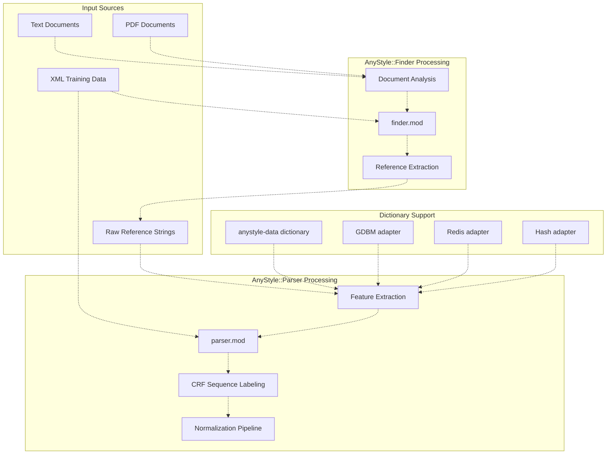
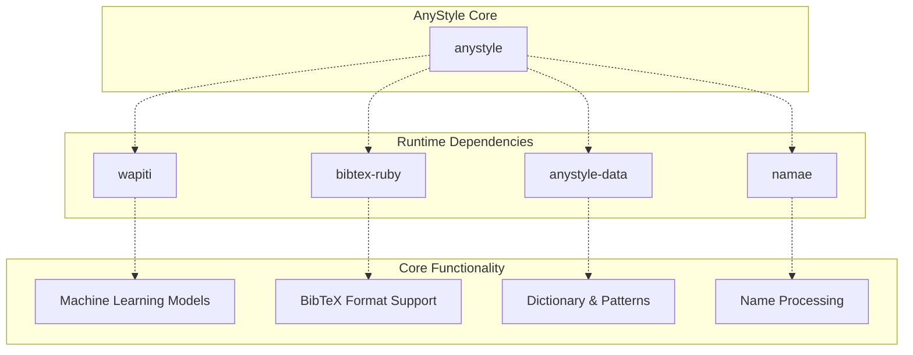
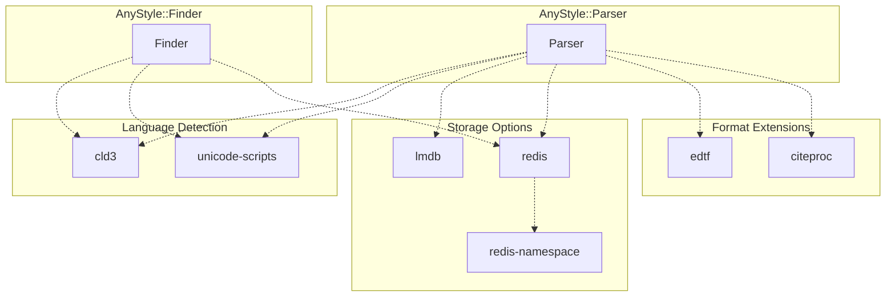
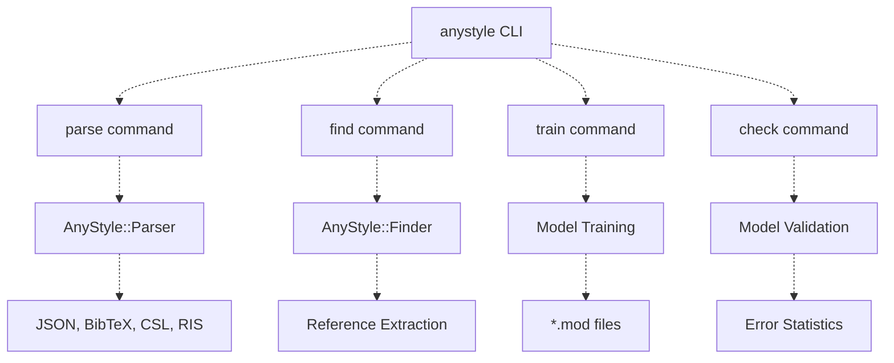
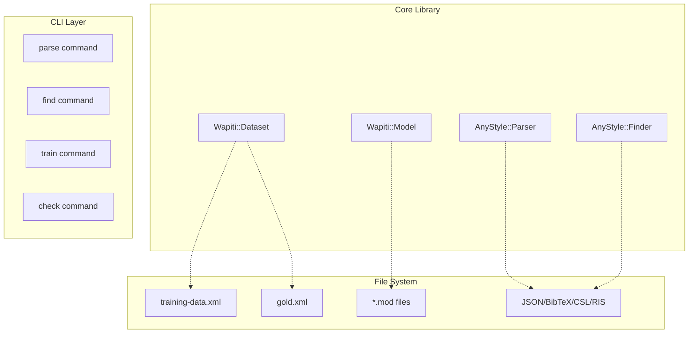
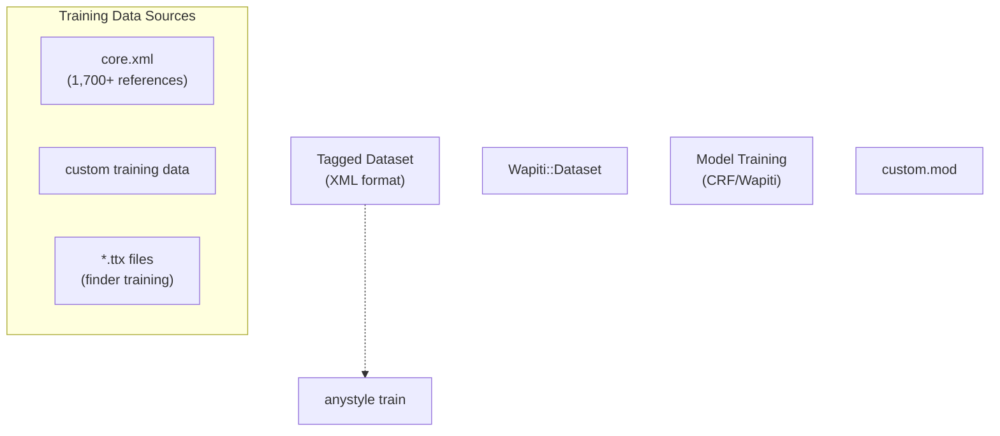
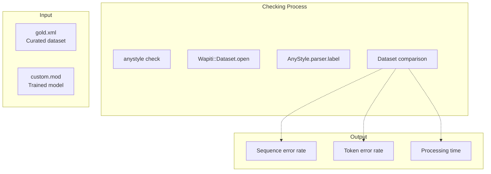
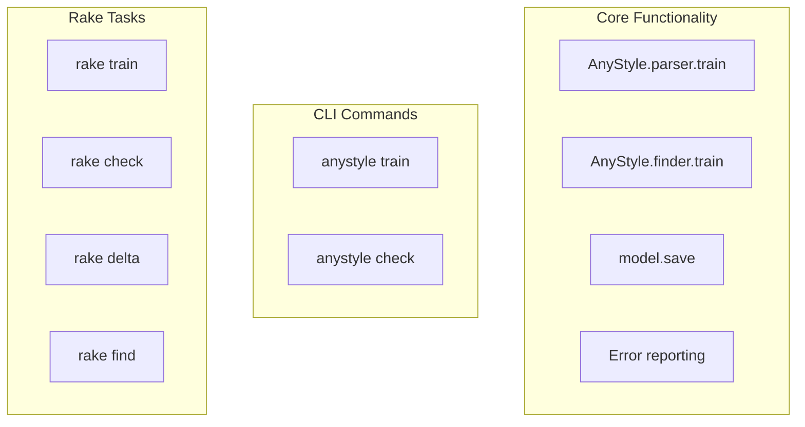

# Overview

# Overview

> **Relevant source files**
> * [.rspec](https://github.com/inukshuk/anystyle/blob/c6f5fb2f/.rspec)
> * [HISTORY.md](https://github.com/inukshuk/anystyle/blob/c6f5fb2f/HISTORY.md)
> * [LICENSE](https://github.com/inukshuk/anystyle/blob/c6f5fb2f/LICENSE)
> * [README.md](https://github.com/inukshuk/anystyle/blob/c6f5fb2f/README.md)
> * [anystyle.gemspec](https://github.com/inukshuk/anystyle/blob/c6f5fb2f/anystyle.gemspec)
> * [lib/anystyle/errors.rb](https://github.com/inukshuk/anystyle/blob/c6f5fb2f/lib/anystyle/errors.rb)
> * [lib/anystyle/version.rb](https://github.com/inukshuk/anystyle/blob/c6f5fb2f/lib/anystyle/version.rb)

## Purpose and Scope

AnyStyle is a sophisticated Ruby-based bibliographic reference parsing system that uses machine learning algorithms to extract and structure academic references. This document provides a high-level overview of AnyStyle's architecture, core components, and capabilities. For specific installation instructions, see [Installation and Dependencies](/inukshuk/anystyle/1.1-installation-and-dependencies). For command-line usage details, see [Command Line Interface](/inukshuk/anystyle/1.2-command-line-interface).

The system consists of two primary components: `AnyStyle::Parser` for parsing individual references and `AnyStyle::Finder` for extracting references from documents. Both components leverage conditional random fields (CRF) through the Wapiti machine learning library to perform sequence labeling tasks.

## System Architecture

### High-Level Component Structure

```mermaid
flowchart TD

AnyStyleMain["AnyStyle v1.6.0"]
AnyStyleParser["AnyStyle::Parser"]
AnyStyleFinder["AnyStyle::Finder"]
AnyStyleError["AnyStyle::Error"]
AnyStyleTrainingError["AnyStyle::TrainingError"]
WapitiLib["wapiti ~>2.1"]
BibtexRuby["bibtex-ruby ~>6.0"]
AnystyleData["anystyle-data ~>1.3"]
Namae["namae ~>1.0"]
CLI["anystyle-cli gem"]
RubyAPI["Ruby API"]
WebApp["anystyle.io"]
CSLFormat["CSL/CiteProc JSON"]
BibtexFormat["BibTeX"]
RISFormat["RIS"]
HashFormat["Ruby Hash/JSON"]

AnyStyleParser -.-> WapitiLib
AnyStyleFinder -.-> WapitiLib
AnyStyleParser -.-> BibtexRuby
AnyStyleParser -.-> Namae
AnyStyleParser -.-> AnystyleData
AnyStyleFinder -.-> AnystyleData
CLI -.-> AnyStyleParser
CLI -.-> AnyStyleFinder
RubyAPI -.-> AnyStyleParser
RubyAPI -.-> AnyStyleFinder
WebApp -.-> AnyStyleParser
WebApp -.-> AnyStyleFinder
AnyStyleParser -.-> CSLFormat
AnyStyleParser -.-> BibtexFormat
AnyStyleParser -.-> RISFormat
AnyStyleParser -.-> HashFormat

subgraph subGraph3 ["Output Formats"]
    CSLFormat
    BibtexFormat
    RISFormat
    HashFormat
end

subgraph subGraph2 ["User Interfaces"]
    CLI
    RubyAPI
    WebApp
end

subgraph subGraph1 ["Core Dependencies"]
    WapitiLib
    BibtexRuby
    AnystyleData
    Namae
end

subgraph subGraph0 ["AnyStyle Module"]
    AnyStyleMain
    AnyStyleParser
    AnyStyleFinder
    AnyStyleError
    AnyStyleTrainingError
    AnyStyleMain -.-> AnyStyleParser
    AnyStyleMain -.-> AnyStyleFinder
    AnyStyleMain -.-> AnyStyleError
    AnyStyleError -.-> AnyStyleTrainingError
end
```



Sources: [lib/anystyle/version.rb L1-L3](https://github.com/inukshuk/anystyle/blob/c6f5fb2f/lib/anystyle/version.rb#L1-L3)

 [anystyle.gemspec L22-L25](https://github.com/inukshuk/anystyle/blob/c6f5fb2f/anystyle.gemspec#L22-L25)

 [lib/anystyle/errors.rb L1-L14](https://github.com/inukshuk/anystyle/blob/c6f5fb2f/lib/anystyle/errors.rb#L1-L14)

 [README.md L6-L11](https://github.com/inukshuk/anystyle/blob/c6f5fb2f/README.md#L6-L11)

### Data Processing Pipeline



Sources: [README.md L28-L48](https://github.com/inukshuk/anystyle/blob/c6f5fb2f/README.md#L28-L48)

 [README.md L167-L207](https://github.com/inukshuk/anystyle/blob/c6f5fb2f/README.md#L167-L207)

 [README.md L72-L85](https://github.com/inukshuk/anystyle/blob/c6f5fb2f/README.md#L72-L85)

## Core Components

### AnyStyle Module

The main `AnyStyle` module serves as the entry point and provides static parser and finder instances through the `AnyStyle.parse` and `AnyStyle.find` methods. The current version is defined as `VERSION = '1.6.0'.freeze` in the version module.

### Parser Component

`AnyStyle::Parser` handles individual bibliographic reference parsing using machine learning models. It processes raw reference strings and outputs structured data in multiple formats including CSL JSON, BibTeX, RIS, and Ruby hashes. The parser uses the `parser.mod` Wapiti model trained on the core XML dataset.

### Finder Component

`AnyStyle::Finder` analyzes full documents (text or PDF) to locate and extract bibliographic references. It uses the `finder.mod` Wapiti model and includes document structure analysis capabilities to identify reference blocks within larger texts.

### Error Handling

The system defines two main error classes: `AnyStyle::Error` as the base exception class and `AnyStyle::TrainingError` for model training-related errors. Both inherit from `StandardError` and include an `original` attribute to preserve underlying exception information.

Sources: [lib/anystyle/version.rb L1-L3](https://github.com/inukshuk/anystyle/blob/c6f5fb2f/lib/anystyle/version.rb#L1-L3)

 [lib/anystyle/errors.rb L1-L14](https://github.com/inukshuk/anystyle/blob/c6f5fb2f/lib/anystyle/errors.rb#L1-L14)

 [README.md L29-L51](https://github.com/inukshuk/anystyle/blob/c6f5fb2f/README.md#L29-L51)

## Key Features and Capabilities

### Machine Learning Foundation

AnyStyle uses conditional random fields (CRF) through the Wapiti library for sequence labeling tasks. The system includes pre-trained models but supports custom model training with user-provided datasets.

### Multi-Language Support

The default training corpus supports multiple languages with English being predominant (965 references), followed by French (54), German (26), Italian (11), and others. The system works with Latin scripts and supports romanized versions of other languages, as well as Cyrillic alphabets.

### Dictionary Adapters

AnyStyle provides flexible dictionary storage options:

* Default persistent Ruby hash adapter
* GDBM adapter for reduced memory footprint
* Redis adapter for distributed scenarios
* In-memory hash adapter for temporary usage

### Format Conversion

The system outputs structured bibliographic data in multiple formats:

* CSL (Citation Style Language) JSON
* BibTeX format
* RIS (Research Information Systems) format
* Ruby Hash/JSON format

Sources: [README.md L124-L164](https://github.com/inukshuk/anystyle/blob/c6f5fb2f/README.md#L124-L164)

 [README.md L167-L207](https://github.com/inukshuk/anystyle/blob/c6f5fb2f/README.md#L167-L207)

 [HISTORY.md L1-L4](https://github.com/inukshuk/anystyle/blob/c6f5fb2f/HISTORY.md#L1-L4)

## Usage Interfaces

### Command Line Interface

The `anystyle-cli` gem provides command-line access to both parsing and finding functionality, with support for custom models, various output formats, and training operations.

### Ruby API

Direct Ruby integration allows creation of custom `AnyStyle::Parser` and `AnyStyle::Finder` instances with configurable options, enabling embedding within larger Ruby applications.

### Web Interface

The web application at anystyle.io provides browser-based access to the parsing functionality and is available as open source for self-hosting.

Sources: [README.md L13-L20](https://github.com/inukshuk/anystyle/blob/c6f5fb2f/README.md#L13-L20)

 [README.md L23-L52](https://github.com/inukshuk/anystyle/blob/c6f5fb2f/README.md#L23-L52)

 [README.md L54-L65](https://github.com/inukshuk/anystyle/blob/c6f5fb2f/README.md#L54-L65)

---

# Installation-and-Dependencies

# Installation and Dependencies

> **Relevant source files**
> * [.rspec](https://github.com/inukshuk/anystyle/blob/c6f5fb2f/.rspec)
> * [Gemfile](https://github.com/inukshuk/anystyle/blob/c6f5fb2f/Gemfile)
> * [anystyle.gemspec](https://github.com/inukshuk/anystyle/blob/c6f5fb2f/anystyle.gemspec)

This page covers the installation process for AnyStyle and provides a comprehensive overview of its dependency structure. It explains the core runtime dependencies required for basic functionality, optional dependencies that enable additional features, and development dependencies needed for contributing to the project.

For information about using the command-line interface after installation, see [Command Line Interface](/inukshuk/anystyle/1.2-command-line-interface). For details about the build system and development tasks, see [Build System and Tasks](/inukshuk/anystyle/5.1-build-system-and-tasks).

## Installation Methods

AnyStyle can be installed as a Ruby gem using the standard gem installation process:

```
gem install anystyle
```

For development work or to access the latest features, you can install from source by cloning the repository and running:

```
bundle install
```

The gem specification defines Ruby 2.2+ as the minimum required version [anystyle.gemspec L20](https://github.com/inukshuk/anystyle/blob/c6f5fb2f/anystyle.gemspec#L20-L20)

## Runtime Dependencies

AnyStyle has four core runtime dependencies that are automatically installed with the gem:

| Dependency | Version | Purpose |
| --- | --- | --- |
| `bibtex-ruby` | ~>6.0 | BibTeX format parsing and generation |
| `anystyle-data` | ~>1.3 | Dictionary data and linguistic resources |
| `wapiti` | ~>2.1 | Machine learning engine for CRF models |
| `namae` | ~>1.0 | Name parsing and normalization |

These dependencies are defined in [anystyle.gemspec L22-L25](https://github.com/inukshuk/anystyle/blob/c6f5fb2f/anystyle.gemspec#L22-L25)

 and provide the core functionality for bibliographic reference parsing and machine learning operations.

**Dependency Architecture**



Sources: [anystyle.gemspec L22-L25](https://github.com/inukshuk/anystyle/blob/c6f5fb2f/anystyle.gemspec#L22-L25)

## Optional Dependencies

AnyStyle includes several optional dependencies that enable enhanced functionality. These are organized in the `extra` group in the Gemfile and must be installed separately:

### Language and Script Detection

* `unicode-scripts` - Unicode script detection for multilingual text
* `cld3` - Compact Language Detector for automatic language identification

### Storage and Caching

* `lmdb` - Lightning Memory-Mapped Database (MRI platforms only)
* `redis` - Redis client for caching support
* `redis-namespace` - Redis namespace support

### Extended Format Support

* `edtf` - Extended Date/Time Format support
* `citeproc` - Citation Style Language processor

The optional dependencies are defined in [Gemfile L26-L35](https://github.com/inukshuk/anystyle/blob/c6f5fb2f/Gemfile#L26-L35)

 and can be installed using:

```
bundle install --with extra
```

**Optional Dependency Integration**



Sources: [Gemfile L26-L35](https://github.com/inukshuk/anystyle/blob/c6f5fb2f/Gemfile#L26-L35)

## Development Dependencies

For contributors and developers working on AnyStyle, additional dependencies are required for testing, debugging, and profiling:

### Core Development Tools

* `rake` - Build automation and task runner
* `rspec` - Testing framework
* `yaml` - YAML processing support

### Code Coverage

* `simplecov` - Code coverage analysis
* `simplecov-lcov` - LCOV format output for coverage reports

### Debugging and Profiling

* `debug` - Ruby debugging tools (>= 1.0.0)
* `ruby-prof` - Ruby profiling tools
* `gnuplot` - Plotting and visualization for profiling data

These dependencies are organized into logical groups in [Gemfile L4-L24](https://github.com/inukshuk/anystyle/blob/c6f5fb2f/Gemfile#L4-L24)

 and can be installed selectively:

```markdown
# Install development and test dependencies
bundle install --with development test

# Install coverage tools
bundle install --with coverage

# Install debugging tools  
bundle install --with debug

# Install profiling tools
bundle install --with profile
```

## Dependency Resolution and Compatibility

The gemspec excludes certain development files from the distributed gem [anystyle.gemspec L27-L39](https://github.com/inukshuk/anystyle/blob/c6f5fb2f/anystyle.gemspec#L27-L39)

 including test files, configuration files, and the core training data (`res/core.xml`). This keeps the distributed gem lightweight while maintaining full functionality.

The gem uses Git-based file listing to determine which files to include, ensuring that only committed files are packaged with the gem. Development dependencies are kept separate from runtime dependencies to minimize installation overhead for end users.

Sources: [Gemfile L1-L36](https://github.com/inukshuk/anystyle/blob/c6f5fb2f/Gemfile#L1-L36)

 [anystyle.gemspec L1-L52](https://github.com/inukshuk/anystyle/blob/c6f5fb2f/anystyle.gemspec#L1-L52)

 [.rspec L1-L4](https://github.com/inukshuk/anystyle/blob/c6f5fb2f/.rspec#L1-L4)

---

# Command-Line-Interface

# Command Line Interface

> **Relevant source files**
> * [LICENSE](https://github.com/inukshuk/anystyle/blob/c6f5fb2f/LICENSE)
> * [README.md](https://github.com/inukshuk/anystyle/blob/c6f5fb2f/README.md)
> * [Rakefile](https://github.com/inukshuk/anystyle/blob/c6f5fb2f/Rakefile)
> * [lib/anystyle/support.rb](https://github.com/inukshuk/anystyle/blob/c6f5fb2f/lib/anystyle/support.rb)
> * [spec/find.rb](https://github.com/inukshuk/anystyle/blob/c6f5fb2f/spec/find.rb)
> * [spec/spec_helper.rb](https://github.com/inukshuk/anystyle/blob/c6f5fb2f/spec/spec_helper.rb)

This document covers the AnyStyle command line interface (CLI) provided by the `anystyle-cli` gem. The CLI enables users to parse bibliographic references, find references in documents, train custom models, and validate model accuracy from the command line.

For information about using AnyStyle programmatically in Ruby applications, see [Overview](/inukshuk/anystyle/1-overview). For details about the underlying parser and finder components, see [Core Components](/inukshuk/anystyle/2-core-components).

## Installation and Basic Usage

The AnyStyle CLI is distributed as a separate gem from the core library:

```
$ [sudo] gem install anystyle-cli
$ anystyle --help
$ anystyle help find
$ anystyle help parse
```

The CLI provides a unified interface to AnyStyle's two main components: the Parser for processing individual references and the Finder for extracting references from documents.

**CLI Command Structure**



Sources: [README.md L13-L20](https://github.com/inukshuk/anystyle/blob/c6f5fb2f/README.md#L13-L20)

 [README.md L84-L94](https://github.com/inukshuk/anystyle/blob/c6f5fb2f/README.md#L84-L94)

## Core Commands

### Parse Command

The `parse` command processes individual bibliographic references and converts them to structured formats:

```
$ anystyle parse input.txt output.json
$ anystyle -f json parse bib.txt -
$ anystyle -P custom.mod -f json parse bib.txt -
```

The parse command integrates with the `AnyStyle::Parser` class to perform sequence labeling on reference strings and output structured bibliographic data.

### Find Command

The `find` command extracts references from full-text documents:

```
$ anystyle find document.pdf references.txt
$ anystyle help find
```

This command uses the `AnyStyle::Finder` component to identify and extract bibliographic references from documents, particularly PDFs and text files.

### Train Command

The `train` command creates custom machine learning models from tagged training data:

```
$ anystyle train training-data.xml custom.mod
```

This command trains either parser or finder models using XML-formatted training datasets and saves the resulting Wapiti models as `.mod` files.

### Check Command

The `check` command validates model accuracy against gold standard datasets:

```
$ anystyle -P x.mod check ./res/parser/gold.xml
Checking gold.xml.................   1 seq  0.06%   3 tok  0.01%  3s
```

Sources: [README.md L84-L113](https://github.com/inukshuk/anystyle/blob/c6f5fb2f/README.md#L84-L113)

## Command Options and Flags

The CLI supports several key options for customizing behavior:

| Flag | Purpose | Example |
| --- | --- | --- |
| `-P, --parser-model` | Specify custom parser model | `-P custom.mod` |
| `-F, --finder-model` | Specify custom finder model | `-F finder.mod` |
| `-f, --format` | Set output format | `-f json` |
| `--help` | Show command help | `anystyle help parse` |

**CLI Integration with Core Components**



Sources: [README.md L88-L94](https://github.com/inukshuk/anystyle/blob/c6f5fb2f/README.md#L88-L94)

## Training Workflow

The CLI provides a complete workflow for training custom models using tagged datasets. The training process involves several key components:

**Training Process Flow**



The training command supports both parser and finder model training. Parser models use XML datasets with tagged references, while finder models use TTX (tagged text) format for document-level training.

Sources: [README.md L70-L86](https://github.com/inukshuk/anystyle/blob/c6f5fb2f/README.md#L70-L86)

 [Rakefile L49-L65](https://github.com/inukshuk/anystyle/blob/c6f5fb2f/Rakefile#L49-L65)

## Model Validation and Quality Checking

The CLI provides comprehensive model validation through the `check` command, which compares model output against gold standard datasets:

```
$ anystyle -P custom.mod check ./res/parser/gold.xml
Checking gold.xml.................   1 seq  0.06%   3 tok  0.01%  3s
```

The validation output provides two key metrics:

* **Sequence errors**: Number of references tagged differently by the parser compared to the gold standard
* **Token errors**: Total number of individual words with incorrect tags

**Model Checking Architecture**



The checking process is implemented in the Rakefile's `:check` task, which iterates through XML datasets and compares parser output with ground truth annotations.

Sources: [README.md L96-L113](https://github.com/inukshuk/anystyle/blob/c6f5fb2f/README.md#L96-L113)

 [Rakefile L68-L88](https://github.com/inukshuk/anystyle/blob/c6f5fb2f/Rakefile#L68-L88)

## Output Formats

The CLI supports multiple output formats for parsed references:

| Format | Description | Usage |
| --- | --- | --- |
| `json` | JSON format with structured fields | `-f json` |
| `bibtex` | BibTeX bibliography format | `-f bibtex` |
| `csl` | Citation Style Language JSON | `-f csl` |
| `ris` | Research Information Systems format | `-f ris` |
| `hash` | Ruby hash format (default) | Default |

The format conversion is handled by the core library's format conversion system, which normalizes parsed data and applies appropriate formatting rules for each output type.

## Integration with Build System

The CLI commands are integrated with the project's build system through Rake tasks that provide programmatic access to the same functionality:

**Rake Task Integration**



The Rake tasks provide additional functionality like batch processing and automated model validation workflows that complement the CLI interface.

Sources: [Rakefile L49-L88](https://github.com/inukshuk/anystyle/blob/c6f5fb2f/Rakefile#L49-L88)

 [spec/find.rb L22-L42](https://github.com/inukshuk/anystyle/blob/c6f5fb2f/spec/find.rb#L22-L42)

---

# Core-Components

# Core Components

> **Relevant source files**
> * [HISTORY.md](https://github.com/inukshuk/anystyle/blob/c6f5fb2f/HISTORY.md)
> * [lib/anystyle.rb](https://github.com/inukshuk/anystyle/blob/c6f5fb2f/lib/anystyle.rb)
> * [lib/anystyle/document.rb](https://github.com/inukshuk/anystyle/blob/c6f5fb2f/lib/anystyle/document.rb)
> * [lib/anystyle/errors.rb](https://github.com/inukshuk/anystyle/blob/c6f5fb2f/lib/anystyle/errors.rb)
> * [lib/anystyle/feature/indent.rb](https://github.com/inukshuk/anystyle/blob/c6f5fb2f/lib/anystyle/feature/indent.rb)
> * [lib/anystyle/finder.rb](https://github.com/inukshuk/anystyle/blob/c6f5fb2f/lib/anystyle/finder.rb)
> * [lib/anystyle/parser.rb](https://github.com/inukshuk/anystyle/blob/c6f5fb2f/lib/anystyle/parser.rb)
> * [lib/anystyle/utils.rb](https://github.com/inukshuk/anystyle/blob/c6f5fb2f/lib/anystyle/utils.rb)
> * [lib/anystyle/version.rb](https://github.com/inukshuk/anystyle/blob/c6f5fb2f/lib/anystyle/version.rb)

This document provides an overview of AnyStyle's primary architectural components and their relationships. AnyStyle is organized around several key classes that work together to provide bibliographic reference parsing and extraction capabilities. For detailed information about specific components, see [AnyStyle::Parser](/inukshuk/anystyle/2.1-anystyle::parser), [AnyStyle::Finder](/inukshuk/anystyle/2.2-anystyle::finder), and [Error Handling and Utilities](/inukshuk/anystyle/2.3-error-handling-and-utilities). For machine learning infrastructure details, see [Machine Learning Infrastructure](/inukshuk/anystyle/3-machine-learning-infrastructure).

## System Architecture Overview

AnyStyle's architecture is built around a modular design with three main processing components that inherit from a common base class:

```

```

**Component Relationships and Data Flow**
Sources: [lib/anystyle.rb L1-L77](https://github.com/inukshuk/anystyle/blob/c6f5fb2f/lib/anystyle.rb#L1-L77)

 [lib/anystyle/parser.rb L1-L210](https://github.com/inukshuk/anystyle/blob/c6f5fb2f/lib/anystyle/parser.rb#L1-L210)

 [lib/anystyle/finder.rb L1-L104](https://github.com/inukshuk/anystyle/blob/c6f5fb2f/lib/anystyle/finder.rb#L1-L104)

## ParserCore Base Class

The `ParserCore` class provides the foundational machine learning infrastructure shared by both `Parser` and `Finder` components:

| Component | Responsibility | Key Methods |
| --- | --- | --- |
| Model Management | Wapiti model loading and lifecycle | `load_model`, `reload`, `stale?` |
| Training Interface | Model training and validation | `train`, `learn`, `check` |
| Data Processing | Input preparation and expansion | `prepare`, `expand`, `label` |
| Normalization | Data cleaning pipeline | `normalize` |

```

```

**ParserCore Architecture and State Management**
Sources: [lib/anystyle/parser.rb L2-L93](https://github.com/inukshuk/anystyle/blob/c6f5fb2f/lib/anystyle/parser.rb#L2-L93)

## Parser Component

The `Parser` class extends `ParserCore` to handle individual bibliographic reference parsing:

```

```

**Parser Feature and Normalizer Pipelines**
Sources: [lib/anystyle/parser.rb L114-L155](https://github.com/inukshuk/anystyle/blob/c6f5fb2f/lib/anystyle/parser.rb#L114-L155)

### Parser Processing Methods

The `Parser` class provides several key processing methods:

| Method | Purpose | Input | Output |
| --- | --- | --- | --- |
| `parse` | Main parsing interface | String/Array of references | Formatted output (hash, bibtex, csl, ris) |
| `expand` | Feature extraction | `Wapiti::Dataset` | Dataset with observations |
| `format_hash` | Convert to hash format | `Wapiti::Dataset` | Array of hashes |
| `flatten_values` | Simplify array values | Hash | Hash with flattened values |

Sources: [lib/anystyle/parser.rb L157-L208](https://github.com/inukshuk/anystyle/blob/c6f5fb2f/lib/anystyle/parser.rb#L157-L208)

## Finder Component

The `Finder` class extends `ParserCore` to extract references from documents:

```

```

**Finder Component Architecture**
Sources: [lib/anystyle/finder.rb L1-L104](https://github.com/inukshuk/anystyle/blob/c6f5fb2f/lib/anystyle/finder.rb#L1-L104)

## Document Class

The `Document` class extends `Wapiti::Sequence` to handle document-level operations:

```

```

**Document Class Structure and Processing**
Sources: [lib/anystyle/document.rb L1-L197](https://github.com/inukshuk/anystyle/blob/c6f5fb2f/lib/anystyle/document.rb#L1-L197)

## Module-Level Interface

The main `AnyStyle` module provides convenient singleton access to the core components:

```

```

**Module-Level Interface**
Sources: [lib/anystyle.rb L60-L76](https://github.com/inukshuk/anystyle/blob/c6f5fb2f/lib/anystyle.rb#L60-L76)

## Utility Infrastructure

AnyStyle includes several utility modules that support the core components:

| Module | Purpose | Key Functions |
| --- | --- | --- |
| `StringUtils` | Text processing utilities | `scrub`, `transliterate`, `canonize`, `display_chars` |
| `PDFUtils` | PDF processing utilities | `pdf_to_text`, `pdf_info`, `pdf_page_size` |
| `Utils` | General utilities | `maybe_require` |

```

```

**Utility Module Functions**
Sources: [lib/anystyle/utils.rb L1-L121](https://github.com/inukshuk/anystyle/blob/c6f5fb2f/lib/anystyle/utils.rb#L1-L121)

## Error Handling

AnyStyle implements a simple error hierarchy for handling processing errors:

```

```

**Error Class Hierarchy**
Sources: [lib/anystyle/errors.rb L1-L15](https://github.com/inukshuk/anystyle/blob/c6f5fb2f/lib/anystyle/errors.rb#L1-L15)

The `Error` class includes an `original` attribute to preserve the underlying exception that caused the error, enabling better debugging and error reporting throughout the system.

---

# AnyStyle-Parser

# AnyStyle::Parser

> **Relevant source files**
> * [lib/anystyle.rb](https://github.com/inukshuk/anystyle/blob/c6f5fb2f/lib/anystyle.rb)
> * [lib/anystyle/parser.rb](https://github.com/inukshuk/anystyle/blob/c6f5fb2f/lib/anystyle/parser.rb)
> * [lib/anystyle/support/parser.mod](https://github.com/inukshuk/anystyle/blob/c6f5fb2f/lib/anystyle/support/parser.mod)
> * [lib/anystyle/support/parser.txt](https://github.com/inukshuk/anystyle/blob/c6f5fb2f/lib/anystyle/support/parser.txt)
> * [spec/anystyle/parser_spec.rb](https://github.com/inukshuk/anystyle/blob/c6f5fb2f/spec/anystyle/parser_spec.rb)

## Purpose and Scope

The `AnyStyle::Parser` component is responsible for parsing individual bibliographic references into structured data. It takes raw reference strings and applies machine learning-based sequence labeling to identify and extract bibliographic elements such as authors, titles, publication venues, dates, and page numbers.

For extracting references from full documents, see [AnyStyle::Finder](/inukshuk/anystyle/2.2-anystyle::finder). For information about the underlying machine learning infrastructure, see [Machine Learning Infrastructure](/inukshuk/anystyle/3-machine-learning-infrastructure).

## Class Architecture

The parser system is built around a two-tier class hierarchy with shared functionality and format-specific capabilities:

```

```

Sources: [lib/anystyle/parser.rb L1-L209](https://github.com/inukshuk/anystyle/blob/c6f5fb2f/lib/anystyle/parser.rb#L1-L209)

## Core Components

### Model and Configuration

The parser loads a pre-trained Wapiti model and maintains configuration options:

| Component | Purpose | Default Value |
| --- | --- | --- |
| `model` | Pre-trained CRF model | `parser.mod` |
| `pattern` | Feature template file | `parser.txt` |
| `separator` | Reference separator regex | `/(?:\r?\n)+/` |
| `delimiter` | Token delimiter regex | Complex Unicode pattern |
| `format` | Default output format | `:hash` |

Sources: [lib/anystyle/parser.rb L103-L112](https://github.com/inukshuk/anystyle/blob/c6f5fb2f/lib/anystyle/parser.rb#L103-L112)

### Feature Extraction Pipeline

The parser uses a comprehensive feature extraction system with 13 different feature types:

```

```

Sources: [lib/anystyle/parser.rb L117-L133](https://github.com/inukshuk/anystyle/blob/c6f5fb2f/lib/anystyle/parser.rb#L117-L133)

### Normalization Pipeline

After sequence labeling, the parser applies 14 normalization steps to clean and standardize the extracted data:

```

```

Sources: [lib/anystyle/parser.rb L135-L154](https://github.com/inukshuk/anystyle/blob/c6f5fb2f/lib/anystyle/parser.rb#L135-L154)

## Processing Pipeline

The parser follows a well-defined processing pipeline from raw input to structured output:

```

```

Sources: [lib/anystyle/parser.rb L157-L166](https://github.com/inukshuk/anystyle/blob/c6f5fb2f/lib/anystyle/parser.rb#L157-L166)

 [lib/anystyle/parser.rb L68-L77](https://github.com/inukshuk/anystyle/blob/c6f5fb2f/lib/anystyle/parser.rb#L68-L77)

 [lib/anystyle/parser.rb L190-L200](https://github.com/inukshuk/anystyle/blob/c6f5fb2f/lib/anystyle/parser.rb#L190-L200)

## Usage Patterns

### Basic Parsing

The parser can be used directly or through the module-level convenience methods:

```

```

### Format-Specific Output

The parser supports multiple output formats controlled by the `format` parameter:

| Format | Description | Method |
| --- | --- | --- |
| `:hash` | Ruby hash (default) | `format_hash()` |
| `:bibtex` | BibTeX format | `format_bibtex()` |
| `:csl` | CSL-JSON format | `format_csl()` |
| `:ris` | RIS format | `format_ris()` |
| `:wapiti` | Raw labeled dataset | N/A |

Sources: [lib/anystyle/parser.rb L190-L200](https://github.com/inukshuk/anystyle/blob/c6f5fb2f/lib/anystyle/parser.rb#L190-L200)

 [lib/anystyle/parser.rb L101](https://github.com/inukshuk/anystyle/blob/c6f5fb2f/lib/anystyle/parser.rb#L101-L101)

### Model Training and Learning

The parser supports both full training and incremental learning:

```

```

Sources: [lib/anystyle/parser.rb L56-L66](https://github.com/inukshuk/anystyle/blob/c6f5fb2f/lib/anystyle/parser.rb#L56-L66)

 [lib/anystyle/parser.rb L52-L54](https://github.com/inukshuk/anystyle/blob/c6f5fb2f/lib/anystyle/parser.rb#L52-L54)

## Configuration and Customization

### Instance Management

The parser uses a singleton pattern for default instances while allowing custom configurations:

```

```

Sources: [lib/anystyle/parser.rb L12-L15](https://github.com/inukshuk/anystyle/blob/c6f5fb2f/lib/anystyle/parser.rb#L12-L15)

### Model Lifecycle

The parser provides methods for managing the underlying ML model:

| Method | Purpose |
| --- | --- |
| `load_model(file)` | Load model from file |
| `reload()` | Reload current model |
| `stale?()` | Check if model file is newer |

Sources: [lib/anystyle/parser.rb L26-L46](https://github.com/inukshuk/anystyle/blob/c6f5fb2f/lib/anystyle/parser.rb#L26-L46)

### Feature and Normalizer Configuration

Both the feature extraction and normalization pipelines can be customized by modifying the `@features` and `@normalizers` arrays during initialization.

Sources: [lib/anystyle/parser.rb L117-L154](https://github.com/inukshuk/anystyle/blob/c6f5fb2f/lib/anystyle/parser.rb#L117-L154)

---

# AnyStyle-Finder

# AnyStyle::Finder

> **Relevant source files**
> * [lib/anystyle/document.rb](https://github.com/inukshuk/anystyle/blob/c6f5fb2f/lib/anystyle/document.rb)
> * [lib/anystyle/feature/indent.rb](https://github.com/inukshuk/anystyle/blob/c6f5fb2f/lib/anystyle/feature/indent.rb)
> * [lib/anystyle/feature/line.rb](https://github.com/inukshuk/anystyle/blob/c6f5fb2f/lib/anystyle/feature/line.rb)
> * [lib/anystyle/feature/ref.rb](https://github.com/inukshuk/anystyle/blob/c6f5fb2f/lib/anystyle/feature/ref.rb)
> * [lib/anystyle/feature/words.rb](https://github.com/inukshuk/anystyle/blob/c6f5fb2f/lib/anystyle/feature/words.rb)
> * [lib/anystyle/finder.rb](https://github.com/inukshuk/anystyle/blob/c6f5fb2f/lib/anystyle/finder.rb)
> * [lib/anystyle/page.rb](https://github.com/inukshuk/anystyle/blob/c6f5fb2f/lib/anystyle/page.rb)
> * [lib/anystyle/support/finder.mod](https://github.com/inukshuk/anystyle/blob/c6f5fb2f/lib/anystyle/support/finder.mod)
> * [lib/anystyle/support/finder.txt](https://github.com/inukshuk/anystyle/blob/c6f5fb2f/lib/anystyle/support/finder.txt)
> * [lib/anystyle/utils.rb](https://github.com/inukshuk/anystyle/blob/c6f5fb2f/lib/anystyle/utils.rb)
> * [spec/anystyle/finder_spec.rb](https://github.com/inukshuk/anystyle/blob/c6f5fb2f/spec/anystyle/finder_spec.rb)

## Purpose and Scope

AnyStyle::Finder is responsible for extracting bibliographic references from documents such as PDFs, text files, and other document formats. It uses machine learning models to identify which lines in a document contain references versus other content like titles, abstracts, or body text.

This component differs from AnyStyle::Parser (see [AnyStyle::Parser](/inukshuk/anystyle/2.1-anystyle::parser)) in that Finder operates at the document level to locate references, while Parser operates on individual reference strings to extract structured bibliographic data. For information about the underlying machine learning infrastructure, see [Machine Learning Infrastructure](/inukshuk/anystyle/3-machine-learning-infrastructure).

## Architecture Overview

The Finder follows a multi-stage pipeline architecture that processes documents through feature extraction, machine learning classification, and output formatting:

```

```

Sources: [lib/anystyle/finder.rb L1-L103](https://github.com/inukshuk/anystyle/blob/c6f5fb2f/lib/anystyle/finder.rb#L1-L103)

 [lib/anystyle/document.rb L1-L196](https://github.com/inukshuk/anystyle/blob/c6f5fb2f/lib/anystyle/document.rb#L1-L196)

## Document Processing Pipeline

The Finder processes documents through a standardized pipeline that handles multiple input formats and converts them into a common internal representation:

```

```

Sources: [lib/anystyle/finder.rb L77-L92](https://github.com/inukshuk/anystyle/blob/c6f5fb2f/lib/anystyle/finder.rb#L77-L92)

 [lib/anystyle/document.rb L20-L43](https://github.com/inukshuk/anystyle/blob/c6f5fb2f/lib/anystyle/document.rb#L20-L43)

 [lib/anystyle/finder.rb L31-L46](https://github.com/inukshuk/anystyle/blob/c6f5fb2f/lib/anystyle/finder.rb#L31-L46)

## Core Classes and Methods

### Finder Class Configuration

The `Finder` class extends `ParserCore` and initializes with specific default options and feature extractors:

| Configuration | Default Value | Purpose |
| --- | --- | --- |
| `model` | `finder.mod` | Wapiti ML model file |
| `pattern` | `finder.txt` | Feature pattern definitions |
| `format` | `:references` | Default output format |
| `training_data` | `finder/*.ttx` | Training data location |
| `layout` | `true` | Preserve PDF layout |

Sources: [lib/anystyle/finder.rb L5-L15](https://github.com/inukshuk/anystyle/blob/c6f5fb2f/lib/anystyle/finder.rb#L5-L15)

### Feature Extraction System

The Finder uses multiple feature extractors that analyze different aspects of document lines:

```

```

Sources: [lib/anystyle/finder.rb L20-L28](https://github.com/inukshuk/anystyle/blob/c6f5fb2f/lib/anystyle/finder.rb#L20-L28)

 [lib/anystyle/feature/line.rb L1-L54](https://github.com/inukshuk/anystyle/blob/c6f5fb2f/lib/anystyle/feature/line.rb#L1-L54)

 [lib/anystyle/feature/words.rb L1-L78](https://github.com/inukshuk/anystyle/blob/c6f5fb2f/lib/anystyle/feature/words.rb#L1-L78)

### Key Processing Methods

The `find()` method serves as the main entry point and delegates to format-specific methods:

```

```

Sources: [lib/anystyle/finder.rb L48-L75](https://github.com/inukshuk/anystyle/blob/c6f5fb2f/lib/anystyle/finder.rb#L48-L75)

 [lib/anystyle/finder.rb L61-L67](https://github.com/inukshuk/anystyle/blob/c6f5fb2f/lib/anystyle/finder.rb#L61-L67)

## Document Structure and Parsing

### Document Class Integration

The `Document` class provides the foundational data structure for the Finder's operations:

| Method | Purpose | Return Type |
| --- | --- | --- |
| `Document.parse()` | Parse string into token sequence | `Document` |
| `Document.open()` | Open file with format detection | `Document` |
| `pages()` | Split document into pages | `Array<Page>` |
| `references()` | Extract reference lines | `Array<String>` |
| `sections()` | Parse document sections | `Array<Hash>` |

Sources: [lib/anystyle/document.rb L9-L43](https://github.com/inukshuk/anystyle/blob/c6f5fb2f/lib/anystyle/document.rb#L9-L43)

 [lib/anystyle/document.rb L145-L165](https://github.com/inukshuk/anystyle/blob/c6f5fb2f/lib/anystyle/document.rb#L145-L165)

### Page and Line Processing

Documents are structured hierarchically through pages and lines, with automatic width calculation and line counting:

```

```

Sources: [lib/anystyle/document.rb L48-L61](https://github.com/inukshuk/anystyle/blob/c6f5fb2f/lib/anystyle/document.rb#L48-L61)

 [lib/anystyle/page.rb L1-L50](https://github.com/inukshuk/anystyle/blob/c6f5fb2f/lib/anystyle/page.rb#L1-L50)

## Machine Learning Integration

### Model and Pattern Files

The Finder uses pre-trained Wapiti models and pattern definitions:

* **finder.mod**: Binary Wapiti model containing learned weights and feature mappings
* **finder.txt**: Human-readable pattern template defining feature extraction rules

The pattern file defines feature templates using Wapiti's template syntax, with features like:

* `U:Ln-1 X=%x[0,1]` - Line length features
* `U:Wrd-1 X=%x[0,13]` - Word count features
* `U:Ref-1 X=%x[0,26]` - Reference indicator features

Sources: [lib/anystyle/finder.rb L6-L7](https://github.com/inukshuk/anystyle/blob/c6f5fb2f/lib/anystyle/finder.rb#L6-L7)

 [lib/anystyle/support/finder.txt L1-L98](https://github.com/inukshuk/anystyle/blob/c6f5fb2f/lib/anystyle/support/finder.txt#L1-L98)

### Training Data Format

Training data consists of `.ttx` files with pipe-delimited labels:

```
title| A1. REFERENCES
blank|
ref| Matsumoto (2006) Ruby: The Programming Language. O'Reilly.
```

Sources: [lib/anystyle/finder.rb L11](https://github.com/inukshuk/anystyle/blob/c6f5fb2f/lib/anystyle/finder.rb#L11-L11)

 [lib/anystyle/document.rb L12-L17](https://github.com/inukshuk/anystyle/blob/c6f5fb2f/lib/anystyle/document.rb#L12-L17)

## Output Formats and Usage

### Format Options

The Finder supports three output formats controlled by the `format` parameter:

| Format | Method | Output Type | Purpose |
| --- | --- | --- | --- |
| `:references` | `format_references()` | `Array<Array<String>>` | Raw reference strings |
| `:hash` | `format_hash()` | `Array<Hash>` | Structured document data |
| `:wapiti` | Direct return | `Wapiti::Dataset` | ML debugging/inspection |

Sources: [lib/anystyle/finder.rb L48-L67](https://github.com/inukshuk/anystyle/blob/c6f5fb2f/lib/anystyle/finder.rb#L48-L67)

### Reference Extraction Process

The reference extraction uses configurable block normalization and section detection:

```

```

Sources: [lib/anystyle/document.rb L145-L165](https://github.com/inukshuk/anystyle/blob/c6f5fb2f/lib/anystyle/document.rb#L145-L165)

 [lib/anystyle/document.rb L167-L169](https://github.com/inukshuk/anystyle/blob/c6f5fb2f/lib/anystyle/document.rb#L167-L169)

## Configuration and Customization

### PDF Processing Options

The Finder integrates with external PDF tools through configurable options:

| Option | Default | Purpose |
| --- | --- | --- |
| `pdftotext` | `'pdftotext'` | PDF text extraction tool |
| `pdfinfo` | `'pdfinfo'` | PDF metadata extraction |
| `layout` | `true` | Preserve layout during extraction |
| `crop` | `false` | Crop PDF pages |
| `encoding` | `'UTF-8'` | Text encoding |

Sources: [lib/anystyle/finder.rb L13-L14](https://github.com/inukshuk/anystyle/blob/c6f5fb2f/lib/anystyle/finder.rb#L13-L14)

 [lib/anystyle/utils.rb L65-L116](https://github.com/inukshuk/anystyle/blob/c6f5fb2f/lib/anystyle/utils.rb#L65-L116)

### Feature Dictionary Integration

The Words feature integrates with an external dictionary for semantic analysis:

```

```

This enables classification of words by their bibliographic relevance (names, locations, publishers, journals).

Sources: [lib/anystyle/finder.rb L23](https://github.com/inukshuk/anystyle/blob/c6f5fb2f/lib/anystyle/finder.rb#L23-L23)

 [lib/anystyle/feature/words.rb L30-L61](https://github.com/inukshuk/anystyle/blob/c6f5fb2f/lib/anystyle/feature/words.rb#L30-L61)

---

# Error-Handling-and-Utilities

# Error Handling and Utilities

> **Relevant source files**
> * [HISTORY.md](https://github.com/inukshuk/anystyle/blob/c6f5fb2f/HISTORY.md)
> * [lib/anystyle/document.rb](https://github.com/inukshuk/anystyle/blob/c6f5fb2f/lib/anystyle/document.rb)
> * [lib/anystyle/errors.rb](https://github.com/inukshuk/anystyle/blob/c6f5fb2f/lib/anystyle/errors.rb)
> * [lib/anystyle/feature/indent.rb](https://github.com/inukshuk/anystyle/blob/c6f5fb2f/lib/anystyle/feature/indent.rb)
> * [lib/anystyle/finder.rb](https://github.com/inukshuk/anystyle/blob/c6f5fb2f/lib/anystyle/finder.rb)
> * [lib/anystyle/utils.rb](https://github.com/inukshuk/anystyle/blob/c6f5fb2f/lib/anystyle/utils.rb)
> * [lib/anystyle/version.rb](https://github.com/inukshuk/anystyle/blob/c6f5fb2f/lib/anystyle/version.rb)

This section documents AnyStyle's error handling infrastructure and utility modules that provide foundational support for the core parsing and finding components. These systems handle exceptional conditions, provide reusable functionality for string and PDF processing, and manage version information.

For information about the main parsing logic, see [AnyStyle::Parser](/inukshuk/anystyle/2.1-anystyle::parser). For document processing workflows, see [AnyStyle::Finder](/inukshuk/anystyle/2.2-anystyle::finder).

## Error Handling System

AnyStyle implements a simple but effective error handling system with custom exception types that preserve underlying error information while providing meaningful context to users.

### Error Class Hierarchy

```

```

The `AnyStyle::Error` base class [lib/anystyle/errors.rb L2-L11](https://github.com/inukshuk/anystyle/blob/c6f5fb2f/lib/anystyle/errors.rb#L2-L11)

 provides error wrapping functionality that preserves the original exception while adding AnyStyle-specific context. The `original` attribute stores the underlying exception, allowing for detailed debugging while maintaining clean error boundaries.

The `AnyStyle::TrainingError` [lib/anystyle/errors.rb L13](https://github.com/inukshuk/anystyle/blob/c6f5fb2f/lib/anystyle/errors.rb#L13-L13)

 specializes error handling for machine learning model training operations, providing more specific error context for training pipeline failures.

Sources: [lib/anystyle/errors.rb L1-L14](https://github.com/inukshuk/anystyle/blob/c6f5fb2f/lib/anystyle/errors.rb#L1-L14)

### Error Usage Patterns

```

```

The error handling system maintains the original exception context through the `original` attribute, enabling detailed error analysis while providing clean error boundaries for the AnyStyle API.

Sources: [lib/anystyle/errors.rb L4-L9](https://github.com/inukshuk/anystyle/blob/c6f5fb2f/lib/anystyle/errors.rb#L4-L9)

## Utility Module System

AnyStyle provides three main utility modules that offer reusable functionality across the system: general utilities, string processing utilities, and PDF processing utilities.

### Utility Module Architecture

```

```

Sources: [lib/anystyle/utils.rb L1-L121](https://github.com/inukshuk/anystyle/blob/c6f5fb2f/lib/anystyle/utils.rb#L1-L121)

### String Processing Utilities

The `StringUtils` module provides comprehensive text processing functionality used throughout AnyStyle's parsing pipeline:

| Method | Purpose | Usage |
| --- | --- | --- |
| `scrub` | Remove non-alphanumeric characters | Text cleaning |
| `transliterate` | Unicode normalization and diacritic removal | Reference standardization |
| `canonize` | Full text canonicalization (scrub + transliterate + downcase) | Matching and comparison |
| `nnum` | Replace digits with symbols | Feature extraction |
| `display_chars` | Clean display characters and whitespace | Layout analysis |
| `indent` | Calculate text indentation | Document structure analysis |

The string utilities [lib/anystyle/utils.rb L14-L60](https://github.com/inukshuk/anystyle/blob/c6f5fb2f/lib/anystyle/utils.rb#L14-L60)

 handle Unicode normalization, text cleaning, and layout analysis critical for processing academic references from various sources and formats.

Sources: [lib/anystyle/utils.rb L11-L60](https://github.com/inukshuk/anystyle/blob/c6f5fb2f/lib/anystyle/utils.rb#L11-L60)

### PDF Processing Utilities

The `PDFUtils` module provides PDF text extraction and metadata processing capabilities:

```

```

The PDF utilities [lib/anystyle/utils.rb L62-L117](https://github.com/inukshuk/anystyle/blob/c6f5fb2f/lib/anystyle/utils.rb#L62-L117)

 provide configurable text extraction with layout preservation, cropping support, and metadata access essential for processing academic papers and documents.

Sources: [lib/anystyle/utils.rb L62-L117](https://github.com/inukshuk/anystyle/blob/c6f5fb2f/lib/anystyle/utils.rb#L62-L117)

## Version Management

AnyStyle uses a simple version management system with a frozen constant:

```

```

The version constant [lib/anystyle/version.rb L2](https://github.com/inukshuk/anystyle/blob/c6f5fb2f/lib/anystyle/version.rb#L2-L2)

 is frozen to prevent modification and follows semantic versioning conventions. This version information is used throughout the build system, gem specification, and runtime identification.

Sources: [lib/anystyle/version.rb L1-L3](https://github.com/inukshuk/anystyle/blob/c6f5fb2f/lib/anystyle/version.rb#L1-L3)

## Integration with Core Components

The utility systems integrate with AnyStyle's core components through mixin patterns and direct usage:

```

```

The `Document` class demonstrates typical integration patterns by including `StringUtils` [lib/anystyle/document.rb L46](https://github.com/inukshuk/anystyle/blob/c6f5fb2f/lib/anystyle/document.rb#L46-L46)

 for text processing and using `PDFUtils` methods [lib/anystyle/document.rb L7](https://github.com/inukshuk/anystyle/blob/c6f5fb2f/lib/anystyle/document.rb#L7-L7)

 for PDF handling. Feature classes similarly include string utilities for text analysis.

Sources: [lib/anystyle/document.rb L46](https://github.com/inukshuk/anystyle/blob/c6f5fb2f/lib/anystyle/document.rb#L46-L46)

 [lib/anystyle/document.rb L7](https://github.com/inukshuk/anystyle/blob/c6f5fb2f/lib/anystyle/document.rb#L7-L7)

 [lib/anystyle/utils.rb L119](https://github.com/inukshuk/anystyle/blob/c6f5fb2f/lib/anystyle/utils.rb#L119-L119)

## Optional Dependency Management

The `Utils` module provides a `maybe_require` method [lib/anystyle/utils.rb L3-L8](https://github.com/inukshuk/anystyle/blob/c6f5fb2f/lib/anystyle/utils.rb#L3-L8)

 for graceful handling of optional dependencies:

```

```

This pattern allows AnyStyle to function with reduced capabilities when optional gems are unavailable, rather than failing entirely. The method is extended into the main `AnyStyle` module [lib/anystyle/utils.rb L119](https://github.com/inukshuk/anystyle/blob/c6f5fb2f/lib/anystyle/utils.rb#L119-L119)

 for use throughout the system.

Sources: [lib/anystyle/utils.rb L3-L8](https://github.com/inukshuk/anystyle/blob/c6f5fb2f/lib/anystyle/utils.rb#L3-L8)

 [lib/anystyle/utils.rb L119](https://github.com/inukshuk/anystyle/blob/c6f5fb2f/lib/anystyle/utils.rb#L119-L119)

---

# Machine-Learning-Infrastructure

# Machine Learning Infrastructure

> **Relevant source files**
> * [lib/anystyle/support/finder.mod](https://github.com/inukshuk/anystyle/blob/c6f5fb2f/lib/anystyle/support/finder.mod)
> * [lib/anystyle/support/parser.mod](https://github.com/inukshuk/anystyle/blob/c6f5fb2f/lib/anystyle/support/parser.mod)
> * [res/parser/core.xml](https://github.com/inukshuk/anystyle/blob/c6f5fb2f/res/parser/core.xml)
> * [res/parser/gold.xml](https://github.com/inukshuk/anystyle/blob/c6f5fb2f/res/parser/gold.xml)

This document provides an overview of AnyStyle's machine learning infrastructure, which powers the core bibliographic reference parsing and document analysis capabilities. The ML infrastructure consists of Conditional Random Field (CRF) models implemented using the Wapiti toolkit, comprehensive training datasets, and sophisticated feature extraction pipelines.

For detailed information about the training datasets and their structure, see [Training Data and Datasets](/inukshuk/anystyle/3.1-training-data-and-datasets). For specifics on the Wapiti model files and pattern matching, see [Models and Pattern Files](/inukshuk/anystyle/3.2-models-and-pattern-files). For the feature extraction pipeline implementation, see [Feature Extraction System](/inukshuk/anystyle/3.3-feature-extraction-system).

## Architecture Overview

AnyStyle's machine learning infrastructure is built around two primary CRF models that work together to process bibliographic references from raw text to structured output.

### ML Component Architecture

```

```

Sources: High-level system diagrams, [lib/anystyle/support/parser.mod L1-L100](https://github.com/inukshuk/anystyle/blob/c6f5fb2f/lib/anystyle/support/parser.mod#L1-L100)

 [res/parser/core.xml L1-L50](https://github.com/inukshuk/anystyle/blob/c6f5fb2f/res/parser/core.xml#L1-L50)

 [res/parser/gold.xml L1-L50](https://github.com/inukshuk/anystyle/blob/c6f5fb2f/res/parser/gold.xml#L1-L50)

### Model Training and Inference Flow

```

```

Sources: Machine Learning Model Architecture diagram, [res/parser/core.xml L1-L100](https://github.com/inukshuk/anystyle/blob/c6f5fb2f/res/parser/core.xml#L1-L100)

 [lib/anystyle/support/parser.mod L1-L100](https://github.com/inukshuk/anystyle/blob/c6f5fb2f/lib/anystyle/support/parser.mod#L1-L100)

## Core Components

### Wapiti CRF Models

The system uses two primary CRF models implemented with the Wapiti toolkit:

* **Parser Model** (`parser.mod`): Performs sequence labeling on individual bibliographic references to identify field boundaries (author, title, journal, etc.)
* **Finder Model** (`finder.mod`): Detects and extracts potential bibliographic references from larger documents

The parser model contains feature templates and learned weights for sequence labeling. The model file format includes feature patterns like:

```yaml
18:u:Tok-1 X=%x[ 0,0],
18:u:tok-1 L=%X[-1,0],
18:u:tok-1 R=%X[ 1,0],
```

These patterns define contextual features used during CRF inference.

Sources: [lib/anystyle/support/parser.mod L1-L100](https://github.com/inukshuk/anystyle/blob/c6f5fb2f/lib/anystyle/support/parser.mod#L1-L100)

### Training Data Structure

The training data consists of XML files with manually annotated bibliographic references:

| File | Purpose | Size | Format |
| --- | --- | --- | --- |
| `core.xml` | Primary training data | ~1,700 references | Tagged XML sequences |
| `gold.xml` | Validation/test data | Smaller validation set | Tagged XML sequences |

Each training example follows this structure:

```

```

Sources: [res/parser/core.xml L1-L50](https://github.com/inukshuk/anystyle/blob/c6f5fb2f/res/parser/core.xml#L1-L50)

 [res/parser/gold.xml L1-L50](https://github.com/inukshuk/anystyle/blob/c6f5fb2f/res/parser/gold.xml#L1-L50)

### Feature Extraction System

The feature extraction pipeline generates multiple types of features for CRF training and inference:

* **Token Features**: Character patterns, capitalization, punctuation
* **Position Features**: Location within reference, sequence position
* **Dictionary Features**: Matching against known names, locations, publishers
* **Contextual Features**: N-gram patterns, neighboring token information

Sources: Feature Extraction System overview from high-level diagrams

## Integration with Core Components

### Parser Integration

```

```

Sources: Core Components overview, AnyStyle::Parser integration

### Finder Integration

```

```

Sources: Core Components overview, AnyStyle::Finder integration

## Training and Evaluation

The ML infrastructure supports comprehensive model training and evaluation workflows:

### Training Pipeline

1. **Data Preparation**: Parse XML training data into feature vectors
2. **Feature Engineering**: Generate contextual and lexical features
3. **Model Training**: Use Wapiti CRF trainer with training data
4. **Model Validation**: Evaluate performance on held-out validation set

### Evaluation Metrics

* **Sequence-level accuracy**: Correctly labeled complete references
* **Token-level accuracy**: Individual field boundary detection
* **Delta analysis**: Comparison of model outputs with gold standard

The training data in `core.xml` contains diverse reference formats including journal articles, books, conference papers, and technical reports, providing comprehensive coverage for model training.

Sources: [res/parser/core.xml L1-L1000](https://github.com/inukshuk/anystyle/blob/c6f5fb2f/res/parser/core.xml#L1-L1000)

 [res/parser/gold.xml L1-L500](https://github.com/inukshuk/anystyle/blob/c6f5fb2f/res/parser/gold.xml#L1-L500)

 Machine Learning Model Architecture diagram

---

# Training-Data-and-Datasets

# Training Data and Datasets

> **Relevant source files**
> * [res/parser/bad.xml](https://github.com/inukshuk/anystyle/blob/c6f5fb2f/res/parser/bad.xml)
> * [res/parser/core.xml](https://github.com/inukshuk/anystyle/blob/c6f5fb2f/res/parser/core.xml)
> * [res/parser/gold.xml](https://github.com/inukshuk/anystyle/blob/c6f5fb2f/res/parser/gold.xml)
> * [res/parser/good.xml](https://github.com/inukshuk/anystyle/blob/c6f5fb2f/res/parser/good.xml)
> * [res/parser/ugly.xml](https://github.com/inukshuk/anystyle/blob/c6f5fb2f/res/parser/ugly.xml)

This document covers the XML training datasets that power AnyStyle's machine learning models for bibliographic reference parsing. These manually annotated datasets provide the ground truth examples needed to train the Wapiti-based sequence labeling models used by `AnyStyle::Parser` and `AnyStyle::Finder`.

For information about the actual ML models and pattern files generated from this training data, see [Models and Pattern Files](/inukshuk/anystyle/3.2-models-and-pattern-files). For details on how features are extracted from this training data during model training, see [Feature Extraction System](/inukshuk/anystyle/3.3-feature-extraction-system).

## Dataset Overview

AnyStyle uses several XML datasets located in the `res/parser/` directory for training and validating its bibliographic reference parsing models. Each dataset contains manually annotated bibliographic references with semantic tags corresponding to different citation components.

### Training Data Flow

```

```

Sources: [res/parser/core.xml L1-L2450](https://github.com/inukshuk/anystyle/blob/c6f5fb2f/res/parser/core.xml#L1-L2450)

 [res/parser/gold.xml L1-L900](https://github.com/inukshuk/anystyle/blob/c6f5fb2f/res/parser/gold.xml#L1-L900)

 [res/parser/good.xml L1-L600](https://github.com/inukshuk/anystyle/blob/c6f5fb2f/res/parser/good.xml#L1-L600)

 [res/parser/bad.xml L1-L400](https://github.com/inukshuk/anystyle/blob/c6f5fb2f/res/parser/bad.xml#L1-L400)

## XML Dataset Structure

All training datasets follow a consistent XML schema with semantic annotation of bibliographic reference components:

### Dataset Schema

```

```

Sources: [res/parser/core.xml L3-L10](https://github.com/inukshuk/anystyle/blob/c6f5fb2f/res/parser/core.xml#L3-L10)

 [res/parser/gold.xml L3-L11](https://github.com/inukshuk/anystyle/blob/c6f5fb2f/res/parser/gold.xml#L3-L11)

## Core Training Datasets

### core.xml - Primary Training Data

The `core.xml` file serves as the main training dataset containing approximately 2,450 manually annotated bibliographic references. This dataset provides the primary examples for training the parser model.

**Example sequence structure:**

```

```

**Key characteristics:**

* Comprehensive coverage of academic reference styles
* Multiple publication types (books, journal articles, conference papers)
* International references in various languages
* Complex citation formats with nested elements

Sources: [res/parser/core.xml L3-L10](https://github.com/inukshuk/anystyle/blob/c6f5fb2f/res/parser/core.xml#L3-L10)

 [res/parser/core.xml L31-L39](https://github.com/inukshuk/anystyle/blob/c6f5fb2f/res/parser/core.xml#L31-L39)

 [res/parser/core.xml L48-L55](https://github.com/inukshuk/anystyle/blob/c6f5fb2f/res/parser/core.xml#L48-L55)

### gold.xml - Validation Dataset

The `gold.xml` file contains approximately 900 high-quality annotated references used for model validation and quality assessment. This dataset helps evaluate parser performance and detect training issues.

**Example biomedical reference:**

```

```

Sources: [res/parser/gold.xml L3-L11](https://github.com/inukshuk/anystyle/blob/c6f5fb2f/res/parser/gold.xml#L3-L11)

 [res/parser/gold.xml L20-L27](https://github.com/inukshuk/anystyle/blob/c6f5fb2f/res/parser/gold.xml#L20-L27)

### good.xml - Supplementary Training Data

The `good.xml` file provides approximately 600 additional training examples, often featuring specialized reference formats or edge cases not covered in the core dataset.

**Example multilingual reference:**

```

```

Sources: [res/parser/good.xml L18-L24](https://github.com/inukshuk/anystyle/blob/c6f5fb2f/res/parser/good.xml#L18-L24)

### bad.xml - Negative Examples

The `bad.xml` file contains approximately 400 examples of problematic or malformed references that can help improve model robustness by providing negative training examples.

Sources: [res/parser/bad.xml L1-L400](https://github.com/inukshuk/anystyle/blob/c6f5fb2f/res/parser/bad.xml#L1-L400)

## Semantic Tag Categories

The training data uses a comprehensive set of semantic tags to annotate different components of bibliographic references:

| Tag Category | XML Elements | Purpose |
| --- | --- | --- |
| **Authors** | `<author>`, `<editor>`, `<translator>` | Person attribution |
| **Titles** | `<title>`, `<container-title>` | Publication titles |
| **Publications** | `<journal>`, `<publisher>` | Publication venues |
| **Metadata** | `<date>`, `<volume>`, `<pages>`, `<edition>` | Publication details |
| **Identifiers** | `<doi>`, `<url>`, `<citation-number>` | Reference identifiers |
| **Classification** | `<genre>`, `<note>`, `<collection-title>` | Additional metadata |
| **Location** | `<location>` | Geographic information |

Sources: [res/parser/core.xml L4-L9](https://github.com/inukshuk/anystyle/blob/c6f5fb2f/res/parser/core.xml#L4-L9)

 [res/parser/gold.xml L4-L10](https://github.com/inukshuk/anystyle/blob/c6f5fb2f/res/parser/gold.xml#L4-L10)

## Training Data Usage

### Model Training Pipeline

```

```

The training datasets are processed through several stages:

1. **XML Parsing**: Training sequences are parsed from XML files
2. **Tokenization**: References are split into individual tokens
3. **Feature Extraction**: Each token gets feature vectors (position, dictionary matches, patterns)
4. **Label Assignment**: Tokens receive IOB tags based on XML semantic tags
5. **Model Training**: Wapiti CRF models learn sequence labeling from feature-label pairs

Sources: [res/parser/core.xml L1-L2450](https://github.com/inukshuk/anystyle/blob/c6f5fb2f/res/parser/core.xml#L1-L2450)

 [res/parser/gold.xml L1-L900](https://github.com/inukshuk/anystyle/blob/c6f5fb2f/res/parser/gold.xml#L1-L900)

### Quality Validation

The training data supports multiple validation approaches:

* **Cross-validation**: Using `gold.xml` as held-out test data
* **Sequence error detection**: Identifying mis-labeled reference sequences
* **Token error analysis**: Finding individual word-level classification errors
* **Delta comparison**: Comparing parser output against gold standard annotations

Sources: [res/parser/gold.xml L1-L900](https://github.com/inukshuk/anystyle/blob/c6f5fb2f/res/parser/gold.xml#L1-L900)

## Dataset Maintenance

The XML training datasets require ongoing maintenance to ensure model quality:

### Data Quality Checks

| Check Type | Purpose | Implementation |
| --- | --- | --- |
| **XML Validation** | Ensure well-formed XML structure | XML schema validation |
| **Tag Consistency** | Verify consistent semantic tagging | Automated tag analysis |
| **Completeness** | Check for missing required elements | Coverage analysis |
| **Encoding** | Validate UTF-8 character encoding | Character validation |

### Coverage Analysis

The training data should provide comprehensive coverage across:

* **Reference types**: Journal articles, books, conference papers, technical reports
* **Citation styles**: APA, MLA, Chicago, IEEE, etc.
* **Languages**: English, French, German, Spanish, Cyrillic scripts
* **Domains**: Scientific, humanities, technical, medical literature
* **Publication eras**: Historical and contemporary references

Sources: [res/parser/core.xml L1-L2450](https://github.com/inukshuk/anystyle/blob/c6f5fb2f/res/parser/core.xml#L1-L2450)

 [res/parser/gold.xml L1-L900](https://github.com/inukshuk/anystyle/blob/c6f5fb2f/res/parser/gold.xml#L1-L900)

 [res/parser/good.xml L1-L600](https://github.com/inukshuk/anystyle/blob/c6f5fb2f/res/parser/good.xml#L1-L600)

 [res/parser/bad.xml L1-L400](https://github.com/inukshuk/anystyle/blob/c6f5fb2f/res/parser/bad.xml#L1-L400)

---

# Models-and-Pattern-Files

# Models and Pattern Files

> **Relevant source files**
> * [lib/anystyle/feature/line.rb](https://github.com/inukshuk/anystyle/blob/c6f5fb2f/lib/anystyle/feature/line.rb)
> * [lib/anystyle/feature/ref.rb](https://github.com/inukshuk/anystyle/blob/c6f5fb2f/lib/anystyle/feature/ref.rb)
> * [lib/anystyle/feature/words.rb](https://github.com/inukshuk/anystyle/blob/c6f5fb2f/lib/anystyle/feature/words.rb)
> * [lib/anystyle/page.rb](https://github.com/inukshuk/anystyle/blob/c6f5fb2f/lib/anystyle/page.rb)
> * [lib/anystyle/support/finder.mod](https://github.com/inukshuk/anystyle/blob/c6f5fb2f/lib/anystyle/support/finder.mod)
> * [lib/anystyle/support/finder.txt](https://github.com/inukshuk/anystyle/blob/c6f5fb2f/lib/anystyle/support/finder.txt)
> * [lib/anystyle/support/parser.mod](https://github.com/inukshuk/anystyle/blob/c6f5fb2f/lib/anystyle/support/parser.mod)
> * [spec/anystyle/finder_spec.rb](https://github.com/inukshuk/anystyle/blob/c6f5fb2f/spec/anystyle/finder_spec.rb)

This page documents the machine learning models and pattern template files that power AnyStyle's sequence labeling capabilities. These files contain the trained Conditional Random Field (CRF) models and feature templates used by the Parser and Finder components for bibliographic reference processing.

For information about training data and datasets used to create these models, see [Training Data and Datasets](/inukshuk/anystyle/3.1-training-data-and-datasets). For details about feature extraction that feeds into these models, see [Feature Extraction System](/inukshuk/anystyle/3.3-feature-extraction-system).

## Overview

AnyStyle uses two primary machine learning models built on the Wapiti CRF framework:

* **Parser Model** (`parser.mod`) - Performs sequence labeling to classify tokens within individual bibliographic references
* **Finder Model** (`finder.mod`) - Identifies reference sections and individual references within documents

These models work in conjunction with pattern template files that define the feature extraction templates used during training and inference.

## Model Architecture

The following diagram shows how the models integrate with AnyStyle's processing pipeline:

```

```

Sources: [lib/anystyle/support/parser.mod L1-L10](https://github.com/inukshuk/anystyle/blob/c6f5fb2f/lib/anystyle/support/parser.mod#L1-L10)

 [lib/anystyle/support/finder.mod L1-L10](https://github.com/inukshuk/anystyle/blob/c6f5fb2f/lib/anystyle/support/finder.mod#L1-L10)

## Parser Model (parser.mod)

The parser model performs sequence labeling on individual bibliographic references to classify each token into bibliographic categories such as author, title, journal, date, etc.

### Model Structure

The parser model file contains:

| Component | Description | Lines |
| --- | --- | --- |
| Header | Model metadata and version info | [lib/anystyle/support/parser.mod L1-L3](https://github.com/inukshuk/anystyle/blob/c6f5fb2f/lib/anystyle/support/parser.mod#L1-L3) |
| Feature Templates | CRF feature pattern definitions | [lib/anystyle/support/parser.mod L4-L63](https://github.com/inukshuk/anystyle/blob/c6f5fb2f/lib/anystyle/support/parser.mod#L4-L63) |
| Label Set | Output label vocabulary | [lib/anystyle/support/parser.mod L64-L87](https://github.com/inukshuk/anystyle/blob/c6f5fb2f/lib/anystyle/support/parser.mod#L64-L87) |
| Model Parameters | Trained CRF weights and transitions | [lib/anystyle/support/parser.mod <br> 88](https://github.com/inukshuk/anystyle/blob/c6f5fb2f/lib/anystyle/support/parser.mod#L88-LNaN) |

### Label Categories

The parser model classifies tokens into the following bibliographic field types:

```

```

Sources: [lib/anystyle/support/parser.mod L64-L87](https://github.com/inukshuk/anystyle/blob/c6f5fb2f/lib/anystyle/support/parser.mod#L64-L87)

## Finder Model (finder.mod)

The finder model performs document-level analysis to identify reference sections and individual references within larger documents.

### Classification Labels

The finder model classifies document lines into these categories:

| Label | Purpose | Description |
| --- | --- | --- |
| `title` | Section headers | Reference section titles and headers |
| `blank` | Whitespace | Empty lines and spacing |
| `text` | Body content | Regular document text |
| `meta` | Metadata | Page numbers, headers, footers |
| `ref` | References | Individual bibliographic references |

Sources: [lib/anystyle/support/finder.mod L73-L78](https://github.com/inukshuk/anystyle/blob/c6f5fb2f/lib/anystyle/support/finder.mod#L73-L78)

### Feature Templates

The finder model uses a comprehensive set of feature templates that analyze:

```

```

Sources: [lib/anystyle/support/finder.txt L4-L97](https://github.com/inukshuk/anystyle/blob/c6f5fb2f/lib/anystyle/support/finder.txt#L4-L97)

## Pattern Template Files

Pattern template files define the feature extraction templates used by the CRF models. These templates specify how to extract features from the input data.

### Template Syntax

The finder template file uses Wapiti's template syntax:

```yaml
*:Ln-1 X=%x[ 0,1]
U:Ln-2 X=%x[ 0,2]
U:Fwd-1 L=%x[-1,17]
U:Fwd-1 X=%x[ 0,17]
U:Fwd-2LL=%x[-2,17]/%x[-1,17]
```

Where:

* `*` indicates unigram templates that can be combined
* `U` indicates unigram templates
* `%x[offset,feature]` extracts feature values at relative positions
* `L`, `X`, `R`, `LL`, `RR` specify left/right context windows

Sources: [lib/anystyle/support/finder.txt L1-L98](https://github.com/inukshuk/anystyle/blob/c6f5fb2f/lib/anystyle/support/finder.txt#L1-L98)

## Model File Format

Both model files follow the Wapiti CRF binary format:

```

```

Sources: [lib/anystyle/support/parser.mod L1-L10](https://github.com/inukshuk/anystyle/blob/c6f5fb2f/lib/anystyle/support/parser.mod#L1-L10)

 [lib/anystyle/support/finder.mod L1-L10](https://github.com/inukshuk/anystyle/blob/c6f5fb2f/lib/anystyle/support/finder.mod#L1-L10)

## Integration with Feature Extraction

The models work closely with AnyStyle's feature extraction system:

```

```

The feature classes generate observations that are formatted according to the pattern templates before being fed to the CRF models.

Sources: [lib/anystyle/feature/line.rb L4-L25](https://github.com/inukshuk/anystyle/blob/c6f5fb2f/lib/anystyle/feature/line.rb#L4-L25)

 [lib/anystyle/feature/words.rb L35-L62](https://github.com/inukshuk/anystyle/blob/c6f5fb2f/lib/anystyle/feature/words.rb#L35-L62)

 [lib/anystyle/feature/ref.rb L4-L12](https://github.com/inukshuk/anystyle/blob/c6f5fb2f/lib/anystyle/feature/ref.rb#L4-L12)

## Model Usage and Loading

The models are loaded and used through AnyStyle's main components:

* **Parser** loads `parser.mod` for reference parsing
* **Finder** loads `finder.mod` for document analysis
* Both use the Wapiti library for CRF inference
* Feature extraction feeds preprocessed data to the models
* Model output is post-processed for final results

The models represent trained CRF parameters that enable AnyStyle to perform sophisticated sequence labeling tasks for bibliographic data processing.

Sources: [lib/anystyle/support/parser.mod L1-L100](https://github.com/inukshuk/anystyle/blob/c6f5fb2f/lib/anystyle/support/parser.mod#L1-L100)

 [lib/anystyle/support/finder.mod L1-L100](https://github.com/inukshuk/anystyle/blob/c6f5fb2f/lib/anystyle/support/finder.mod#L1-L100)

 [lib/anystyle/support/finder.txt L1-L98](https://github.com/inukshuk/anystyle/blob/c6f5fb2f/lib/anystyle/support/finder.txt#L1-L98)

---

# Feature-Extraction-System

# Feature Extraction System

> **Relevant source files**
> * [lib/anystyle/feature.rb](https://github.com/inukshuk/anystyle/blob/c6f5fb2f/lib/anystyle/feature.rb)
> * [lib/anystyle/feature/brackets.rb](https://github.com/inukshuk/anystyle/blob/c6f5fb2f/lib/anystyle/feature/brackets.rb)
> * [lib/anystyle/feature/keyword.rb](https://github.com/inukshuk/anystyle/blob/c6f5fb2f/lib/anystyle/feature/keyword.rb)
> * [lib/anystyle/feature/position.rb](https://github.com/inukshuk/anystyle/blob/c6f5fb2f/lib/anystyle/feature/position.rb)
> * [lib/anystyle/feature/punctuation.rb](https://github.com/inukshuk/anystyle/blob/c6f5fb2f/lib/anystyle/feature/punctuation.rb)
> * [lib/anystyle/feature/quotes.rb](https://github.com/inukshuk/anystyle/blob/c6f5fb2f/lib/anystyle/feature/quotes.rb)
> * [lib/anystyle/feature/terminal.rb](https://github.com/inukshuk/anystyle/blob/c6f5fb2f/lib/anystyle/feature/terminal.rb)

## Purpose and Scope

The Feature Extraction System is responsible for converting raw text tokens into structured feature vectors that feed into AnyStyle's machine learning models. This system transforms linguistic and structural properties of bibliographic text into numerical representations that enable the Wapiti CRF models to perform sequence labeling for both reference parsing and document analysis.

For information about the machine learning models that consume these features, see [Models and Pattern Files](/inukshuk/anystyle/3.2-models-and-pattern-files). For details about how features are used in the broader processing pipeline, see [Data Processing Pipeline](/inukshuk/anystyle/4-data-processing-pipeline).

## Base Feature Architecture

The feature extraction system is built around a common base class `Feature` that defines the interface for all feature extractors. Each feature class implements an `observe` method that takes a token and returns a symbolic representation of that token's characteristics.

```

```

**Sources**: [lib/anystyle/feature.rb L1-L27](https://github.com/inukshuk/anystyle/blob/c6f5fb2f/lib/anystyle/feature.rb#L1-L27)

The base `Feature` class provides common functionality including precision handling for numerical ratios and utility methods for accessing neighboring tokens in a sequence. The `precision` parameter controls the granularity of ratio calculations used in positional features.

## Feature Types and Classifications

### Keyword Feature

The `Keyword` feature is the most comprehensive feature extractor, identifying semantic roles and publication types through pattern matching against multilingual regular expressions.

| Feature Category | Patterns | Symbol |
| --- | --- | --- |
| Author roles | `著`, `撰`, `compilador` | `:author` |
| Editor roles | `ed`, `editors`, `hg`, `herausgeber`, `編` | `:editor` |
| Translator roles | `trans`, `übers`, `trad`, `譯` | `:translator` |
| Publication types | `journal`, `proceedings`, `thesis`, `patent` | `:journal`, `:proceedings`, `:thesis`, `:patent` |
| Structural elements | `pp`, `vol`, `edition`, `doi`, `pmid` | `:page`, `:volume`, `:edition`, `:locator`, `:pubmed` |
| Temporal indicators | `jan`, `spring`, `年` | `:date` |
| Logical connectors | `and`, `in`, `etal` | `:and`, `:in`, `:etal` |

**Sources**: [lib/anystyle/feature/keyword.rb L1-L71](https://github.com/inukshuk/anystyle/blob/c6f5fb2f/lib/anystyle/feature/keyword.rb#L1-L71)

### Structural Features

The remaining feature classes focus on structural and typographical characteristics:

```

```

**Sources**: [lib/anystyle/feature/punctuation.rb L1-L22](https://github.com/inukshuk/anystyle/blob/c6f5fb2f/lib/anystyle/feature/punctuation.rb#L1-L22)

 [lib/anystyle/feature/position.rb L1-L28](https://github.com/inukshuk/anystyle/blob/c6f5fb2f/lib/anystyle/feature/position.rb#L1-L28)

 [lib/anystyle/feature/terminal.rb L1-L19](https://github.com/inukshuk/anystyle/blob/c6f5fb2f/lib/anystyle/feature/terminal.rb#L1-L19)

 [lib/anystyle/feature/brackets.rb L1-L32](https://github.com/inukshuk/anystyle/blob/c6f5fb2f/lib/anystyle/feature/brackets.rb#L1-L32)

 [lib/anystyle/feature/quotes.rb L1-L20](https://github.com/inukshuk/anystyle/blob/c6f5fb2f/lib/anystyle/feature/quotes.rb#L1-L20)

### Position Feature

The `Position` feature provides contextual information about a token's location within a sequence:

* `:only` - Single token in sequence
* `:first` - First token in sequence
* `:last` - Last token in sequence
* `ratio` - Numerical ratio of position (0-precision scale)

The position calculation uses the `ratio` method from the base class: `(position.to_f / total_length) * precision`.round`.

**Sources**: [lib/anystyle/feature/position.rb L15-L25](https://github.com/inukshuk/anystyle/blob/c6f5fb2f/lib/anystyle/feature/position.rb#L15-L25)

## Feature Observation Process

The feature extraction process follows a consistent pattern across all feature types:

```

```

**Sources**: [lib/anystyle/feature.rb L11-L13](https://github.com/inukshuk/anystyle/blob/c6f5fb2f/lib/anystyle/feature.rb#L11-L13)

 [lib/anystyle/feature/keyword.rb L5-L67](https://github.com/inukshuk/anystyle/blob/c6f5fb2f/lib/anystyle/feature/keyword.rb#L5-L67)

Each feature's `observe` method receives:

* `token` - The raw text token
* `alpha` - Normalized alphabetic version (for keyword matching)
* `opts` - Context information (sequence index, full sequence, etc.)

## Integration with Machine Learning Pipeline

The extracted features serve as input to the Wapiti CRF models for sequence labeling. The feature extraction system bridges the gap between raw bibliographic text and the structured data required for machine learning:

```

```

**Sources**: [lib/anystyle/feature.rb L1-L27](https://github.com/inukshuk/anystyle/blob/c6f5fb2f/lib/anystyle/feature.rb#L1-L27)

 [lib/anystyle/feature/keyword.rb L1-L71](https://github.com/inukshuk/anystyle/blob/c6f5fb2f/lib/anystyle/feature/keyword.rb#L1-L71)

The feature extraction system is designed to be:

* **Extensible**: New feature classes can be added by inheriting from the base `Feature` class
* **Multilingual**: Supports pattern matching across multiple languages and scripts
* **Context-aware**: Features can access neighboring tokens and sequence information
* **Precision-configurable**: Numerical features can be tuned via the precision parameter

This modular architecture enables AnyStyle to adapt to different bibliographic styles and languages while maintaining consistent feature representation for machine learning.

---

# Data-Processing-Pipeline

# Data Processing Pipeline

> **Relevant source files**
> * [lib/anystyle.rb](https://github.com/inukshuk/anystyle/blob/c6f5fb2f/lib/anystyle.rb)
> * [lib/anystyle/normalizer.rb](https://github.com/inukshuk/anystyle/blob/c6f5fb2f/lib/anystyle/normalizer.rb)
> * [lib/anystyle/normalizer/volume.rb](https://github.com/inukshuk/anystyle/blob/c6f5fb2f/lib/anystyle/normalizer/volume.rb)
> * [lib/anystyle/parser.rb](https://github.com/inukshuk/anystyle/blob/c6f5fb2f/lib/anystyle/parser.rb)
> * [lib/anystyle/refs.rb](https://github.com/inukshuk/anystyle/blob/c6f5fb2f/lib/anystyle/refs.rb)
> * [spec/anystyle/document_spec.rb](https://github.com/inukshuk/anystyle/blob/c6f5fb2f/spec/anystyle/document_spec.rb)
> * [spec/anystyle/normalizer/volume_spec.rb](https://github.com/inukshuk/anystyle/blob/c6f5fb2f/spec/anystyle/normalizer/volume_spec.rb)
> * [spec/anystyle/refs_spec.rb](https://github.com/inukshuk/anystyle/blob/c6f5fb2f/spec/anystyle/refs_spec.rb)
> * [spec/fixtures/ref-join.yml](https://github.com/inukshuk/anystyle/blob/c6f5fb2f/spec/fixtures/ref-join.yml)

This document describes how data flows through AnyStyle's processing pipeline from raw input to structured output. It covers the complete end-to-end processing workflow including input preparation, feature extraction, machine learning inference, reference joining, normalization, and format conversion.

For information about the individual ML models and training data, see [Machine Learning Infrastructure](/inukshuk/anystyle/3-machine-learning-infrastructure). For details about specific output formats, see [Format Conversion](/inukshuk/anystyle/4.2-format-conversion).

## Overview

AnyStyle's data processing pipeline transforms unstructured bibliographic data into clean, structured references through a multi-stage process. The pipeline handles two main workflows:

1. **Document Processing**: Uses `AnyStyle::Finder` to extract reference candidates from documents
2. **Reference Parsing**: Uses `AnyStyle::Parser` to parse individual references into structured fields

Both workflows share common infrastructure for feature extraction, normalization, and output formatting.

## High-Level Pipeline Architecture

```

```

Sources: [lib/anystyle/parser.rb L83-L92](https://github.com/inukshuk/anystyle/blob/c6f5fb2f/lib/anystyle/parser.rb#L83-L92)

 [lib/anystyle/parser.rb L157-L166](https://github.com/inukshuk/anystyle/blob/c6f5fb2f/lib/anystyle/parser.rb#L157-L166)

 [lib/anystyle/refs.rb L6-L10](https://github.com/inukshuk/anystyle/blob/c6f5fb2f/lib/anystyle/refs.rb#L6-L10)

## Input Processing and Preparation

The `prepare` method in `ParserCore` handles input normalization and conversion to the internal `Wapiti::Dataset` format used throughout the pipeline.

### Input Format Handling

| Input Type | Processing Method | Description |
| --- | --- | --- |
| `String` | `Wapiti::Dataset.parse()` | Raw text split by separators |
| `Array` | Join with newlines | Multiple reference strings |
| `Wapiti::Dataset` | Direct processing | Pre-tokenized data |
| `Wapiti::Sequence` | Wrap in dataset | Single sequence |

The Parser uses configurable separators and delimiters:

* **Separator**: `/(?:\r?\n)+/` - Splits references
* **Delimiter**: `/(\s|\p{Space_Separator})+|([\uFF01-\uFF64]|。|、)/` - Tokenizes within references

```

```

Sources: [lib/anystyle/parser.rb L83-L92](https://github.com/inukshuk/anystyle/blob/c6f5fb2f/lib/anystyle/parser.rb#L83-L92)

 [lib/anystyle/parser.rb L202-L207](https://github.com/inukshuk/anystyle/blob/c6f5fb2f/lib/anystyle/parser.rb#L202-L207)

 [lib/anystyle/parser.rb L108-L109](https://github.com/inukshuk/anystyle/blob/c6f5fb2f/lib/anystyle/parser.rb#L108-L109)

## Feature Extraction Pipeline

The `expand` method adds feature observations to each token in the dataset. Features are extracted by a configurable set of feature classes that analyze different aspects of the text.

### Parser Feature Set

The Parser initializes 13 feature extractors in a specific order:

```

```

Each feature extracts specific observations:

* `Canonical`: Normalized token form
* `Category`: Character type classification
* `Affix`: Prefix/suffix patterns
* `Caps`: Capitalization patterns
* `Number`: Numeric patterns
* `Dictionary`: Keyword matching
* `Position`: Token position in sequence
* `Punctuation`: Punctuation analysis
* `Brackets`: Bracket/quote matching

Sources: [lib/anystyle/parser.rb L117-L133](https://github.com/inukshuk/anystyle/blob/c6f5fb2f/lib/anystyle/parser.rb#L117-L133)

 [lib/anystyle/parser.rb L157-L166](https://github.com/inukshuk/anystyle/blob/c6f5fb2f/lib/anystyle/parser.rb#L157-L166)

## Reference Processing and Joining

The `Refs` class handles multi-line reference joining using a sophisticated scoring algorithm. This is crucial for processing references that span multiple lines in documents.

### Reference Joining Algorithm

```

```

### Scoring Criteria

| Score Type | Positive Indicators | Negative Indicators |
| --- | --- | --- |
| **Indent** | Positive indentation (+1.25) | Negative indentation (-1) |
| **Delta** | No blank lines (+1) | Many blank lines (-1) |
| **Years** | Year patterns match context | Year at end of line (-0.5) |
| **Terminal** | Ends with comma/semicolon (+2) | Ends with period/bracket (-1) |
| **Initial** | Starts lowercase (+1.5) | Starts with list marker (-1.5) |
| **Length** | Shorter continuation lines (+2.5) | Much longer than previous (-0.5) |
| **Pages** | Contains page numbers (+1) | Previous line has pages (-0.25) |

Sources: [lib/anystyle/refs.rb L88-L99](https://github.com/inukshuk/anystyle/blob/c6f5fb2f/lib/anystyle/refs.rb#L88-L99)

 [lib/anystyle/refs.rb L101-L242](https://github.com/inukshuk/anystyle/blob/c6f5fb2f/lib/anystyle/refs.rb#L101-L242)

## Normalization Pipeline

After ML labeling, the `normalize` method runs a sequence of normalizers to clean and standardize the parsed data. Each normalizer processes specific fields and may extract additional information.

### Normalizer Sequence

```

```

### Example: Volume Normalizer

The Volume normalizer demonstrates the complexity of field extraction and cleaning:

* Extracts volume, issue, and page information from combined strings
* Handles multiple international formats (German "Jg.", French "n°", etc.)
* Extracts embedded dates when no date field exists
* Cleans HTML tags and formatting

Key patterns handled:

* `14(2):` → volume: "14", issue: "2"
* `vol. 93, no. 2,` → volume: "93", issue: "2"
* `2008;2(3):` → volume: "2", issue: "3", date: "2008"

Sources: [lib/anystyle/parser.rb L135-L154](https://github.com/inukshuk/anystyle/blob/c6f5fb2f/lib/anystyle/parser.rb#L135-L154)

 [lib/anystyle/parser.rb L68-L77](https://github.com/inukshuk/anystyle/blob/c6f5fb2f/lib/anystyle/parser.rb#L68-L77)

 [lib/anystyle/normalizer/volume.rb L8-L48](https://github.com/inukshuk/anystyle/blob/c6f5fb2f/lib/anystyle/normalizer/volume.rb#L8-L48)

## Format Conversion Pipeline

The final stage converts normalized data into the requested output format. The Parser supports multiple output formats through dedicated formatter methods.

### Format Conversion Flow

```

```

All non-wapiti formats follow the same pattern:

1. Call `label()` to get ML predictions
2. Apply format-specific transformation via `format_*` method
3. Return structured output

Sources: [lib/anystyle/parser.rb L190-L200](https://github.com/inukshuk/anystyle/blob/c6f5fb2f/lib/anystyle/parser.rb#L190-L200)

 [lib/anystyle/parser.rb L168-L172](https://github.com/inukshuk/anystyle/blob/c6f5fb2f/lib/anystyle/parser.rb#L168-L172)

 [lib/anystyle/parser.rb L96-L100](https://github.com/inukshuk/anystyle/blob/c6f5fb2f/lib/anystyle/parser.rb#L96-L100)

## Error Handling and Resilience

The pipeline includes error handling at critical points:

* **Normalizer errors**: Caught and logged with warnings, processing continues [lib/anystyle/parser.rb L70-L76](https://github.com/inukshuk/anystyle/blob/c6f5fb2f/lib/anystyle/parser.rb#L70-L76)
* **Model loading**: Supports fallback and reload mechanisms [lib/anystyle/parser.rb L40-L42](https://github.com/inukshuk/anystyle/blob/c6f5fb2f/lib/anystyle/parser.rb#L40-L42)
* **Value flattening**: Handles arrays and edge cases in output formatting [lib/anystyle/parser.rb L174-L184](https://github.com/inukshuk/anystyle/blob/c6f5fb2f/lib/anystyle/parser.rb#L174-L184)

The pipeline is designed to be resilient, continuing processing even when individual components encounter errors, ensuring maximum data recovery from imperfect inputs.

Sources: [lib/anystyle/parser.rb L68-L77](https://github.com/inukshuk/anystyle/blob/c6f5fb2f/lib/anystyle/parser.rb#L68-L77)

 [lib/anystyle/parser.rb L26-L46](https://github.com/inukshuk/anystyle/blob/c6f5fb2f/lib/anystyle/parser.rb#L26-L46)

---

# Normalization-System

# Normalization System

> **Relevant source files**
> * [lib/anystyle/normalizer.rb](https://github.com/inukshuk/anystyle/blob/c6f5fb2f/lib/anystyle/normalizer.rb)
> * [lib/anystyle/normalizer/container.rb](https://github.com/inukshuk/anystyle/blob/c6f5fb2f/lib/anystyle/normalizer/container.rb)
> * [lib/anystyle/normalizer/names.rb](https://github.com/inukshuk/anystyle/blob/c6f5fb2f/lib/anystyle/normalizer/names.rb)
> * [lib/anystyle/normalizer/punctuation.rb](https://github.com/inukshuk/anystyle/blob/c6f5fb2f/lib/anystyle/normalizer/punctuation.rb)
> * [lib/anystyle/normalizer/volume.rb](https://github.com/inukshuk/anystyle/blob/c6f5fb2f/lib/anystyle/normalizer/volume.rb)
> * [spec/anystyle/normalizer/container_spec.rb](https://github.com/inukshuk/anystyle/blob/c6f5fb2f/spec/anystyle/normalizer/container_spec.rb)
> * [spec/anystyle/normalizer/names_spec.rb](https://github.com/inukshuk/anystyle/blob/c6f5fb2f/spec/anystyle/normalizer/names_spec.rb)
> * [spec/anystyle/normalizer/volume_spec.rb](https://github.com/inukshuk/anystyle/blob/c6f5fb2f/spec/anystyle/normalizer/volume_spec.rb)

The Normalization System is responsible for cleaning, standardizing, and extracting structured data from parsed bibliographic references. After the machine learning models have performed sequence labeling on references (see [AnyStyle::Parser](/inukshuk/anystyle/2.1-anystyle::parser)), the normalization pipeline processes the raw tagged output to produce clean, structured bibliographic data.

This system operates through a collection of specialized normalizer classes that each handle specific aspects of reference data cleanup. For information about the feature extraction that occurs before normalization, see [Feature Extraction System](/inukshuk/anystyle/3.3-feature-extraction-system). For details on converting normalized data to output formats, see [Format Conversion](/inukshuk/anystyle/4.2-format-conversion).

## Architecture Overview

The normalization system follows a modular pipeline architecture where each normalizer operates independently on specific fields of bibliographic data. The system processes references through multiple specialized normalizers that clean different aspects of the data.

### Normalizer Pipeline Architecture

```

```

Sources: [lib/anystyle/normalizer.rb L1-L65](https://github.com/inukshuk/anystyle/blob/c6f5fb2f/lib/anystyle/normalizer.rb#L1-L65)

 [lib/anystyle/normalizer/names.rb L1-L88](https://github.com/inukshuk/anystyle/blob/c6f5fb2f/lib/anystyle/normalizer/names.rb#L1-L88)

 [lib/anystyle/normalizer/volume.rb L1-L52](https://github.com/inukshuk/anystyle/blob/c6f5fb2f/lib/anystyle/normalizer/volume.rb#L1-L52)

 [lib/anystyle/normalizer/punctuation.rb L1-L26](https://github.com/inukshuk/anystyle/blob/c6f5fb2f/lib/anystyle/normalizer/punctuation.rb#L1-L26)

 [lib/anystyle/normalizer/container.rb L1-L18](https://github.com/inukshuk/anystyle/blob/c6f5fb2f/lib/anystyle/normalizer/container.rb#L1-L18)

## Base Normalizer Class

The `AnyStyle::Normalizer` class provides the foundation for all specialized normalizers. It defines the interface and common functionality used across the normalization pipeline.

### Core Methods and Structure

| Method | Purpose | Implementation |
| --- | --- | --- |
| `@keys` | Class variable defining which fields the normalizer processes | Each subclass sets specific field keys |
| `normalize(item, **opts)` | Main normalization method (must be implemented by subclasses) | Raises `NotImplementedError` in base class |
| `map_values(item, keys)` | Iterates over field values and applies transformations | [lib/anystyle/normalizer.rb L42-L51](https://github.com/inukshuk/anystyle/blob/c6f5fb2f/lib/anystyle/normalizer.rb#L42-L51) |
| `append(item, key, value)` | Adds values to existing or new fields | [lib/anystyle/normalizer.rb L25-L31](https://github.com/inukshuk/anystyle/blob/c6f5fb2f/lib/anystyle/normalizer.rb#L25-L31) |
| `each_value(item, keys)` | Iterates over field values without transformation | [lib/anystyle/normalizer.rb L33-L40](https://github.com/inukshuk/anystyle/blob/c6f5fb2f/lib/anystyle/normalizer.rb#L33-L40) |

### Normalizer Control Flow

```

```

Sources: [lib/anystyle/normalizer.rb L21-L23](https://github.com/inukshuk/anystyle/blob/c6f5fb2f/lib/anystyle/normalizer.rb#L21-L23)

 [lib/anystyle/normalizer.rb L42-L51](https://github.com/inukshuk/anystyle/blob/c6f5fb2f/lib/anystyle/normalizer.rb#L42-L51)

 [lib/anystyle/normalizer.rb L53-L59](https://github.com/inukshuk/anystyle/blob/c6f5fb2f/lib/anystyle/normalizer.rb#L53-L59)

 [lib/anystyle/normalizer.rb L61-L63](https://github.com/inukshuk/anystyle/blob/c6f5fb2f/lib/anystyle/normalizer.rb#L61-L63)

## Names Normalizer

The `AnyStyle::Normalizer::Names` class handles parsing and standardization of author, editor, translator, director, and producer names using the `namae` gem for sophisticated name parsing.

### Name Processing Pipeline

```

```

Sources: [lib/anystyle/normalizer/names.rb L15-L21](https://github.com/inukshuk/anystyle/blob/c6f5fb2f/lib/anystyle/normalizer/names.rb#L15-L21)

 [lib/anystyle/normalizer/names.rb L23-L36](https://github.com/inukshuk/anystyle/blob/c6f5fb2f/lib/anystyle/normalizer/names.rb#L23-L36)

 [lib/anystyle/normalizer/names.rb L65-L85](https://github.com/inukshuk/anystyle/blob/c6f5fb2f/lib/anystyle/normalizer/names.rb#L65-L85)

 [lib/anystyle/normalizer/names.rb L39-L41](https://github.com/inukshuk/anystyle/blob/c6f5fb2f/lib/anystyle/normalizer/names.rb#L39-L41)

### Pattern Stripping Rules

The `strip` method removes various editor, translator, and directorial patterns from name strings:

| Pattern Type | Examples | Regex Pattern |
| --- | --- | --- |
| Editor patterns | "Ed.", "editors", "Hrsg." | `/\b[EÉeé]d(s?. |
| Translator patterns | "Trans.", "übersetzt von" | `/\b[Tt]rans(l?. |
| Director patterns | "Dir.", "directed by" | `/\b([Dd]ir(. |
| Producer patterns | "Prod.", "produced by" | `/\b([Pp]rod(. |

Sources: [lib/anystyle/normalizer/names.rb L43-L63](https://github.com/inukshuk/anystyle/blob/c6f5fb2f/lib/anystyle/normalizer/names.rb#L43-L63)

## Volume Normalizer

The `AnyStyle::Normalizer::Volume` class extracts volume numbers, issue numbers, page ranges, and dates from complex volume strings using sophisticated regex patterns.

### Volume Pattern Matching

```

```

Sources: [lib/anystyle/normalizer/volume.rb L8-L47](https://github.com/inukshuk/anystyle/blob/c6f5fb2f/lib/anystyle/normalizer/volume.rb#L8-L47)

 [lib/anystyle/normalizer/volume.rb L6](https://github.com/inukshuk/anystyle/blob/c6f5fb2f/lib/anystyle/normalizer/volume.rb#L6-L6)

 [lib/anystyle/normalizer/volume.rb L12-L16](https://github.com/inukshuk/anystyle/blob/c6f5fb2f/lib/anystyle/normalizer/volume.rb#L12-L16)

### Volume Number Pattern

The `VOLNUM_RX` constant defines the core pattern for matching volume numbers: `'(\p{Lu}?\d+|[IVXLCDM]+)'`. This matches:

* Alphanumeric volumes: `14`, `B200`, `SAC-4`
* Roman numerals: `XIV`, `LXVI`, `CLXXXIII`
* Letter-prefixed numbers: `Vol. 14`

Sources: [lib/anystyle/normalizer/volume.rb L6](https://github.com/inukshuk/anystyle/blob/c6f5fb2f/lib/anystyle/normalizer/volume.rb#L6-L6)

## Punctuation Normalizer

The `AnyStyle::Normalizer::Punctuation` class removes trailing punctuation from text fields to standardize field endings.

### Punctuation Cleaning Rules

| Operation | Pattern | Purpose |
| --- | --- | --- |
| Trailing cleanup | `/\s*[\)\]\.,:;\p{Pd}\p{Z}\p{C}。、》〉]+$/` | Remove trailing punctuation and whitespace |
| Final punctuation | `/[,:;》〉]+$/` | Remove specific trailing punctuation marks |
| Leading brackets | `/^[\(\[《〈]/` | Remove leading bracket characters |
| HTML tags | `/<\/?(italic\|bold)>/` | Remove simple HTML formatting |

The normalizer operates on fields including `container-title`, `collection-title`, `date`, `edition`, `journal`, `location`, `publisher`, and `title`.

Sources: [lib/anystyle/normalizer/punctuation.rb L4-L13](https://github.com/inukshuk/anystyle/blob/c6f5fb2f/lib/anystyle/normalizer/punctuation.rb#L4-L13)

 [lib/anystyle/normalizer/punctuation.rb L16-L22](https://github.com/inukshuk/anystyle/blob/c6f5fb2f/lib/anystyle/normalizer/punctuation.rb#L16-L22)

## Container Title Normalizer

The `AnyStyle::Normalizer::Container` class standardizes container titles by removing common prefixes that indicate the reference is contained within another work.

### Container Prefix Patterns

```

```

Sources: [lib/anystyle/normalizer/container.rb L6-L14](https://github.com/inukshuk/anystyle/blob/c6f5fb2f/lib/anystyle/normalizer/container.rb#L6-L14)

## Normalization Workflow

The normalization system processes bibliographic items through each applicable normalizer, with each normalizer operating only on its designated fields as specified by the `@keys` class variable.

### Field-Specific Processing

| Normalizer | Target Fields | Primary Function |
| --- | --- | --- |
| `Names` | `:author`, `:editor`, `:translator`, `:director`, `:producer` | Parse name strings into structured name objects |
| `Volume` | `:volume`, `:pages`, `:date` | Extract volume/issue/page information |
| `Punctuation` | `:title`, `:journal`, `:location`, `:publisher`, etc. | Remove trailing punctuation |
| `Container` | `:container-title` | Clean container title prefixes |

The system's modular design allows for easy extension with additional normalizers for specific data cleaning requirements.

Sources: [lib/anystyle/normalizer/names.rb L6-L8](https://github.com/inukshuk/anystyle/blob/c6f5fb2f/lib/anystyle/normalizer/names.rb#L6-L8)

 [lib/anystyle/normalizer/volume.rb L4](https://github.com/inukshuk/anystyle/blob/c6f5fb2f/lib/anystyle/normalizer/volume.rb#L4-L4)

 [lib/anystyle/normalizer/punctuation.rb L4-L13](https://github.com/inukshuk/anystyle/blob/c6f5fb2f/lib/anystyle/normalizer/punctuation.rb#L4-L13)

 [lib/anystyle/normalizer/container.rb L4](https://github.com/inukshuk/anystyle/blob/c6f5fb2f/lib/anystyle/normalizer/container.rb#L4-L4)

---

# Format-Conversion

# Format Conversion

> **Relevant source files**
> * [LICENSE](https://github.com/inukshuk/anystyle/blob/c6f5fb2f/LICENSE)
> * [README.md](https://github.com/inukshuk/anystyle/blob/c6f5fb2f/README.md)
> * [lib/anystyle/format/bibtex.rb](https://github.com/inukshuk/anystyle/blob/c6f5fb2f/lib/anystyle/format/bibtex.rb)
> * [lib/anystyle/format/csl.rb](https://github.com/inukshuk/anystyle/blob/c6f5fb2f/lib/anystyle/format/csl.rb)
> * [spec/anystyle/format/bibtex_spec.rb](https://github.com/inukshuk/anystyle/blob/c6f5fb2f/spec/anystyle/format/bibtex_spec.rb)
> * [spec/anystyle/format/csl_spec.rb](https://github.com/inukshuk/anystyle/blob/c6f5fb2f/spec/anystyle/format/csl_spec.rb)

## Purpose and Scope

Format conversion is the final stage of AnyStyle's data processing pipeline, responsible for transforming normalized bibliographic references into various standardized output formats. This system converts the internal hash representation of parsed references into formats suitable for different bibliographic tools and workflows.

The format conversion system supports multiple output formats including CSL/CiteProc for citation processors, BibTeX for LaTeX workflows, and structured hash/JSON for programmatic use. For information about the normalization process that precedes format conversion, see [Normalization System](/inukshuk/anystyle/4.1-normalization-system).

## Format Conversion Pipeline

The format conversion process occurs after reference parsing and normalization, transforming the standardized internal representation into format-specific outputs:

```

```

**Sources:** [lib/anystyle/format/csl.rb L4-L24](https://github.com/inukshuk/anystyle/blob/c6f5fb2f/lib/anystyle/format/csl.rb#L4-L24)

 [lib/anystyle/format/bibtex.rb L12-L45](https://github.com/inukshuk/anystyle/blob/c6f5fb2f/lib/anystyle/format/bibtex.rb#L12-L45)

## Supported Output Formats

AnyStyle supports multiple bibliographic formats through dedicated format modules:

| Format | Module | Output Type | Use Case |
| --- | --- | --- | --- |
| Hash/JSON | Built-in | `Array<Hash>` | Programmatic access, APIs |
| CSL/CiteProc | `Format::CSL` | `Array<Hash>` | Citation processors, Zotero |
| BibTeX | `Format::BibTeX` | `BibTeX::Bibliography` | LaTeX, reference managers |
| RIS | `Format::RIS` | `String` | EndNote, Mendeley |

The default output format is hash/JSON, which preserves all parsed information without format-specific transformations.

**Sources:** [README.md L33-L47](https://github.com/inukshuk/anystyle/blob/c6f5fb2f/README.md#L33-L47)

 [lib/anystyle/format/csl.rb L1-L45](https://github.com/inukshuk/anystyle/blob/c6f5fb2f/lib/anystyle/format/csl.rb#L1-L45)

 [lib/anystyle/format/bibtex.rb L1-L63](https://github.com/inukshuk/anystyle/blob/c6f5fb2f/lib/anystyle/format/bibtex.rb#L1-L63)

## Format Module Architecture

The format conversion system uses a modular architecture where each format is implemented as a separate module:

```

```

**Sources:** [lib/anystyle/format/csl.rb L1-L3](https://github.com/inukshuk/anystyle/blob/c6f5fb2f/lib/anystyle/format/csl.rb#L1-L3)

 [lib/anystyle/format/bibtex.rb L1-L3](https://github.com/inukshuk/anystyle/blob/c6f5fb2f/lib/anystyle/format/bibtex.rb#L1-L3)

## CSL Format Implementation

The CSL (Citation Style Language) format converter transforms references into CiteProc-compatible JSON:

### Core Functionality

The `format_csl` method processes references through several transformation steps:

1. **Base Hash Processing**: Calls `format_hash(dataset)` to prepare the internal representation
2. **Date Conversion**: Transforms dates using `dates_to_citeproc()` method
3. **Value Flattening**: Flattens array values except for name fields
4. **Field Renaming**: Maps internal field names to CSL standard names
5. **Name Processing**: Filters out name entries marked with `:others`

### Field Mappings

The CSL format applies specific field name transformations:

| Internal Field | CSL Field | Purpose |
| --- | --- | --- |
| `:pages` | `:page` | Page range specification |
| `:location` | `:publisher-place` | Publication location |
| `:url` | `:URL` | Web address |
| `:doi` | `:DOI` | Digital Object Identifier |
| `:pmid` | `:PMID` | PubMed ID |
| `:pmcid` | `:PMCID` | PubMed Central ID |

### Date Format Options

The CSL converter supports two date format modes:

* **EDTF format** (default): Extended Date/Time Format strings
* **CiteProc format**: Structured date objects with date-parts arrays

**Sources:** [lib/anystyle/format/csl.rb L4-L42](https://github.com/inukshuk/anystyle/blob/c6f5fb2f/lib/anystyle/format/csl.rb#L4-L42)

 [spec/anystyle/format/csl_spec.rb L22-L26](https://github.com/inukshuk/anystyle/blob/c6f5fb2f/spec/anystyle/format/csl_spec.rb#L22-L26)

## BibTeX Format Implementation

The BibTeX format converter produces `BibTeX::Bibliography` objects compatible with LaTeX workflows:

### Type Mapping System

BibTeX uses a type mapping system to convert CSL types to BibTeX entry types:

```

```

### Field Transformations

BibTeX format applies context-sensitive field mappings based on entry type:

| Entry Type | Internal Field | BibTeX Field | Context |
| --- | --- | --- | --- |
| `article` | `:container-title` | `:journal` | Journal articles |
| `article` | `:issue` | `:number` | Issue numbers |
| `techreport` | `:publisher` | `:institution` | Technical reports |
| `thesis` | `:publisher` | `:school` | Academic theses |
| All types | `:location` | `:address` | Publication location |
| All types | `:accessed` | `:urldate` | Access dates |

### Name Processing

The BibTeX format implements special name processing in the `names_to_bibtex` method:

* Converts structured name objects to BibTeX name strings
* Handles literal names, family/given name combinations
* Joins multiple names with " and " separator
* Formats names as "Family, Suffix, Given"

**Sources:** [lib/anystyle/format/bibtex.rb L4-L60](https://github.com/inukshuk/anystyle/blob/c6f5fb2f/lib/anystyle/format/bibtex.rb#L4-L60)

 [spec/anystyle/format/bibtex_spec.rb L9-L18](https://github.com/inukshuk/anystyle/blob/c6f5fb2f/spec/anystyle/format/bibtex_spec.rb#L9-L18)

## Usage Examples

### Programmatic Usage

Format conversion is typically invoked through the Parser's `parse` method with a `format` parameter:

```

```

### Command Line Usage

The format conversion system integrates with the command-line interface:

```

```

**Sources:** [README.md L92-L94](https://github.com/inukshuk/anystyle/blob/c6f5fb2f/README.md#L92-L94)

 [spec/anystyle/format/csl_spec.rb L10-L13](https://github.com/inukshuk/anystyle/blob/c6f5fb2f/spec/anystyle/format/csl_spec.rb#L10-L13)

 [spec/anystyle/format/bibtex_spec.rb L9-L12](https://github.com/inukshuk/anystyle/blob/c6f5fb2f/spec/anystyle/format/bibtex_spec.rb#L9-L12)

## Value Processing Pipeline

The format conversion system implements a consistent value processing pipeline across all formats:

```

```

The `flatten_values` helper method converts array values to single values for most fields, while preserving structured data for name fields that require special processing.

**Sources:** [lib/anystyle/format/csl.rb L7-L8](https://github.com/inukshuk/anystyle/blob/c6f5fb2f/lib/anystyle/format/csl.rb#L7-L8)

 [lib/anystyle/format/bibtex.rb L17-L18](https://github.com/inukshuk/anystyle/blob/c6f5fb2f/lib/anystyle/format/bibtex.rb#L17-L18)

 [lib/anystyle/format/csl.rb L16-L20](https://github.com/inukshuk/anystyle/blob/c6f5fb2f/lib/anystyle/format/csl.rb#L16-L20)

 [lib/anystyle/format/bibtex.rb L32-L34](https://github.com/inukshuk/anystyle/blob/c6f5fb2f/lib/anystyle/format/bibtex.rb#L32-L34)

---

# Reference-Processing-and-Joining

# Reference Processing and Joining

> **Relevant source files**
> * [lib/anystyle/document.rb](https://github.com/inukshuk/anystyle/blob/c6f5fb2f/lib/anystyle/document.rb)
> * [lib/anystyle/feature/indent.rb](https://github.com/inukshuk/anystyle/blob/c6f5fb2f/lib/anystyle/feature/indent.rb)
> * [lib/anystyle/finder.rb](https://github.com/inukshuk/anystyle/blob/c6f5fb2f/lib/anystyle/finder.rb)
> * [lib/anystyle/refs.rb](https://github.com/inukshuk/anystyle/blob/c6f5fb2f/lib/anystyle/refs.rb)
> * [lib/anystyle/utils.rb](https://github.com/inukshuk/anystyle/blob/c6f5fb2f/lib/anystyle/utils.rb)
> * [spec/anystyle/document_spec.rb](https://github.com/inukshuk/anystyle/blob/c6f5fb2f/spec/anystyle/document_spec.rb)
> * [spec/anystyle/refs_spec.rb](https://github.com/inukshuk/anystyle/blob/c6f5fb2f/spec/anystyle/refs_spec.rb)
> * [spec/fixtures/ref-join.yml](https://github.com/inukshuk/anystyle/blob/c6f5fb2f/spec/fixtures/ref-join.yml)

This page covers AnyStyle's system for processing and joining multi-line bibliographic references. The system addresses the common problem where bibliographic references span multiple lines in documents, requiring intelligent logic to determine which consecutive lines belong to the same reference versus being separate references.

For information about individual reference parsing after joining, see [AnyStyle::Parser](/inukshuk/anystyle/2.1-anystyle::parser). For document-level reference extraction, see [AnyStyle::Finder](/inukshuk/anystyle/2.2-anystyle::finder).

## Reference Joining Problem

When bibliographic references are extracted from documents, they often span multiple lines due to formatting constraints, line wrapping, or document layout. The reference joining system must distinguish between:

* **Continuation lines**: Lines that belong to the same reference as the previous line
* **New references**: Lines that start a new bibliographic reference
* **Non-reference content**: Lines that should be ignored or treated as text

## Refs Class Architecture

The `AnyStyle::Refs` class implements the core reference processing and joining logic through a state machine that processes document lines sequentially.

### Core Processing Flow

```

```

Sources: [lib/anystyle/refs.rb L5-L86](https://github.com/inukshuk/anystyle/blob/c6f5fb2f/lib/anystyle/refs.rb#L5-L86)

### State Management

The `Refs` class maintains processing state through several key attributes:

| Attribute | Purpose | Default |
| --- | --- | --- |
| `@pending` | Current reference being built | `nil` |
| `@indent` | Indentation level of current reference | `0` |
| `@delta` | Number of blank lines since last reference content | `0` |
| `@max_delta` | Maximum blank lines before committing reference | `10` |

Sources: [lib/anystyle/refs.rb L32-L46](https://github.com/inukshuk/anystyle/blob/c6f5fb2f/lib/anystyle/refs.rb#L32-L46)

## Joining Decision Algorithm

The `join?` method determines whether two reference parts should be joined using a weighted scoring system with multiple heuristics.

### Scoring Components

```

```

Sources: [lib/anystyle/refs.rb L88-L99](https://github.com/inukshuk/anystyle/blob/c6f5fb2f/lib/anystyle/refs.rb#L88-L99)

### Individual Scoring Methods

#### Indent Score

Analyzes indentation changes between reference lines:

* Positive indent (+1.25): Strong indication of continuation
* Negative indent (-1): Strong indication of new reference
* No change (0): Neutral

#### Delta Score

Considers blank lines between reference parts:

* No blank lines (1): Strong continuation signal
* One blank line (0.5): Moderate continuation
* Multiple blank lines (-0.5 to -1): Indicates separation

#### Content Analysis Scores

* **Years Score**: Detects year patterns and reference completeness
* **Terminal Score**: Analyzes punctuation and ending patterns
* **Initial Score**: Examines beginning patterns (capitalization, special markers)
* **Length Score**: Considers relative lengths of reference parts
* **Pages Score**: Detects page number patterns

Sources: [lib/anystyle/refs.rb L101-L242](https://github.com/inukshuk/anystyle/blob/c6f5fb2f/lib/anystyle/refs.rb#L101-L242)

## Reference Normalization

The `normalize!` method converts `text` labeled lines to `ref` labels within reference sections, improving reference detection accuracy.

### Normalization Algorithm

```

```

The normalization uses different window sizes based on context:

* **Reference sections** (max_win_size: 6): Detected by section headers matching `/references|bibliogra/i`
* **Other sections** (max_win_size: 2): More conservative conversion

Sources: [lib/anystyle/refs.rb L12-L29](https://github.com/inukshuk/anystyle/blob/c6f5fb2f/lib/anystyle/refs.rb#L12-L29)

 [lib/anystyle/document.rb L145-L165](https://github.com/inukshuk/anystyle/blob/c6f5fb2f/lib/anystyle/document.rb#L145-L165)

## Integration with Document Processing

Reference processing integrates with the broader AnyStyle system through the `Document` class and `Finder` component.

### Document Processing Flow

```

```

Sources: [lib/anystyle/document.rb L145-L165](https://github.com/inukshuk/anystyle/blob/c6f5fb2f/lib/anystyle/document.rb#L145-L165)

 [lib/anystyle/document.rb L167-L169](https://github.com/inukshuk/anystyle/blob/c6f5fb2f/lib/anystyle/document.rb#L167-L169)

## Test Coverage and Examples

The reference joining system includes comprehensive test coverage with real-world examples demonstrating various joining scenarios.

### Test Fixture Structure

The test fixtures in `spec/fixtures/ref-join.yml` contain examples with:

* `a`: First reference part
* `b`: Second reference part
* `delta`: Number of blank lines between parts
* `indent`: Indentation change
* `join`: Expected joining decision

Example scenarios include:

* **Author-title splits**: When author names and titles are on separate lines
* **Title-publication splits**: When titles and publication info are separated
* **Multi-line citations**: Long references spanning multiple lines
* **False positives**: Cases where lines should NOT be joined

Sources: [spec/fixtures/ref-join.yml L1-L242](https://github.com/inukshuk/anystyle/blob/c6f5fb2f/spec/fixtures/ref-join.yml#L1-L242)

 [spec/anystyle/refs_spec.rb L5-L16](https://github.com/inukshuk/anystyle/blob/c6f5fb2f/spec/anystyle/refs_spec.rb#L5-L16)

The joining algorithm achieves high accuracy across diverse reference formatting styles by combining multiple heuristic approaches with configurable thresholds and context-aware processing.

---

# Locale-and-Type-Detection

# Locale and Type Detection

> **Relevant source files**
> * [lib/anystyle/normalizer/locale.rb](https://github.com/inukshuk/anystyle/blob/c6f5fb2f/lib/anystyle/normalizer/locale.rb)
> * [lib/anystyle/normalizer/locator.rb](https://github.com/inukshuk/anystyle/blob/c6f5fb2f/lib/anystyle/normalizer/locator.rb)
> * [lib/anystyle/normalizer/type.rb](https://github.com/inukshuk/anystyle/blob/c6f5fb2f/lib/anystyle/normalizer/type.rb)
> * [spec/anystyle/normalizer/locator_spec.rb](https://github.com/inukshuk/anystyle/blob/c6f5fb2f/spec/anystyle/normalizer/locator_spec.rb)

This section covers AnyStyle's locale and type detection systems, which automatically identify the language, script, and publication type of bibliographic references during the normalization pipeline. These detection mechanisms help ensure proper formatting and processing of references from diverse linguistic and publication contexts.

For information about the broader normalization system, see [Normalization System](/inukshuk/anystyle/4.1-normalization-system). For details on format conversion that uses type information, see [Format Conversion](/inukshuk/anystyle/4.2-format-conversion).

## Language Detection System

AnyStyle implements automatic language detection using the CLD3 (Compact Language Detector 3) library. The `Locale` normalizer extracts sample text from key bibliographic fields and identifies the language to set appropriate metadata.

### Detection Process

```

```

The language detection prioritizes content-rich fields and requires a minimum text length of 8 characters for reliable detection [lib/anystyle/normalizer/locale.rb L36](https://github.com/inukshuk/anystyle/blob/c6f5fb2f/lib/anystyle/normalizer/locale.rb#L36-L36)

### Implementation Details

| Component | Purpose | Configuration |
| --- | --- | --- |
| `CLD3::NNetLanguageIdentifier` | Neural network-based language detection | `min_bytes: 0, max_bytes: 1000` |
| Sample text extraction | Combines multiple bibliographic fields | Flattens and joins field values |
| Conditional detection | Avoids detection on short text | Minimum 8 characters required |

Sources: [lib/anystyle/normalizer/locale.rb L1-L45](https://github.com/inukshuk/anystyle/blob/c6f5fb2f/lib/anystyle/normalizer/locale.rb#L1-L45)

## Script Detection System

Alongside language detection, AnyStyle identifies Unicode scripts present in bibliographic references using the `unicode-scripts` gem. This helps handle multilingual references and ensures proper character encoding.

### Script Analysis Flow

```

```

The script detection works on the same sample text as language detection and identifies all Unicode scripts present in the text [lib/anystyle/normalizer/locale.rb L42](https://github.com/inukshuk/anystyle/blob/c6f5fb2f/lib/anystyle/normalizer/locale.rb#L42-L42)

Sources: [lib/anystyle/normalizer/locale.rb L41-L43](https://github.com/inukshuk/anystyle/blob/c6f5fb2f/lib/anystyle/normalizer/locale.rb#L41-L43)

## Publication Type Classification

The `Type` normalizer automatically classifies references into publication types using rule-based heuristics. This classification supports proper formatting in output formats like CSL and BibTeX.

### Classification Decision Tree

```

```

### Classification Rules

| Priority | Condition | Result Type | Pattern Examples |
| --- | --- | --- | --- |
| 1 | Has `:container-title` + `:issue` | `article-journal` | Journal articles with issue numbers |
| 2 | Container matches conference patterns | `paper-conference` | "proceedings", "conference", "symposium" |
| 3 | Container matches journal patterns | `article-journal` | "journal", "quarterly", "review" |
| 4 | Container present (fallback) | `chapter` | Book chapters, anthology pieces |
| 5 | Genre/note matches thesis patterns | `thesis` | "ph.d", "dissertation", "thesis" |
| 6 | Genre/note matches report patterns | `report` | "report" |
| 7 | Genre/note matches manuscript patterns | `manuscript` | "unpublished", "manuscript" |
| 8 | Genre/note matches web patterns | `webpage` | "web", "online", "en ligne" |
| 9 | Medium matches video patterns | `motion_picture` | "dvd", "video", "motion" |
| 10 | Medium matches TV patterns | `broadcast` | "television" |
| 11 | Has `:publisher` | `book` | Books with publisher information |

Sources: [lib/anystyle/normalizer/type.rb L1-L54](https://github.com/inukshuk/anystyle/blob/c6f5fb2f/lib/anystyle/normalizer/type.rb#L1-L54)

## Integration with Normalization Pipeline

The locale and type detection systems integrate into the broader normalization pipeline as individual normalizer components that can be applied selectively or as part of the complete normalization process.

### Normalizer Component Architecture

```

```

Each normalizer operates on the reference item hash and adds or modifies specific fields:

* `Locale`: Adds `:language` and `:scripts` fields
* `Type`: Adds `:type` field for publication classification
* `Locator`: Processes `:doi`, `:isbn`, and `:url` fields

Sources: [lib/anystyle/normalizer/locale.rb L1-L45](https://github.com/inukshuk/anystyle/blob/c6f5fb2f/lib/anystyle/normalizer/locale.rb#L1-L45)

 [lib/anystyle/normalizer/type.rb L1-L54](https://github.com/inukshuk/anystyle/blob/c6f5fb2f/lib/anystyle/normalizer/type.rb#L1-L54)

 [lib/anystyle/normalizer/locator.rb L1-L35](https://github.com/inukshuk/anystyle/blob/c6f5fb2f/lib/anystyle/normalizer/locator.rb#L1-L35)

---

# Development-and-Testing

# Development and Testing

> **Relevant source files**
> * [.github/workflows/ci.yml](https://github.com/inukshuk/anystyle/blob/c6f5fb2f/.github/workflows/ci.yml)
> * [.gitignore](https://github.com/inukshuk/anystyle/blob/c6f5fb2f/.gitignore)
> * [.simplecov](https://github.com/inukshuk/anystyle/blob/c6f5fb2f/.simplecov)
> * [Rakefile](https://github.com/inukshuk/anystyle/blob/c6f5fb2f/Rakefile)
> * [lib/anystyle/support.rb](https://github.com/inukshuk/anystyle/blob/c6f5fb2f/lib/anystyle/support.rb)
> * [spec/find.rb](https://github.com/inukshuk/anystyle/blob/c6f5fb2f/spec/find.rb)
> * [spec/spec_helper.rb](https://github.com/inukshuk/anystyle/blob/c6f5fb2f/spec/spec_helper.rb)

This document provides a comprehensive guide for developers working on the AnyStyle codebase, covering the build system, testing infrastructure, model training workflows, and continuous integration setup. It focuses on the technical infrastructure that supports AnyStyle development rather than the core parsing functionality.

For detailed information about specific aspects of development, see [Build System and Tasks](/inukshuk/anystyle/5.1-build-system-and-tasks), [Testing Framework](/inukshuk/anystyle/5.2-testing-framework), and [Continuous Integration](/inukshuk/anystyle/5.3-continuous-integration).

## Build System Overview

AnyStyle uses a Rake-based build system that provides tasks for gem building, model training, validation, and development utilities. The build system is centralized in the `Rakefile` which defines several key workflows.

### Core Build Tasks

The primary build tasks handle gem packaging and release management:

| Task | Purpose | Implementation |
| --- | --- | --- |
| `build` | Creates gem package | Runs `gem build anystyle-parser.gemspec` |
| `release` | Tags and publishes gem | Creates git tag and pushes to RubyGems |
| `clean` | Removes build artifacts | Cleans `*.gem` and `*.rbc` files |

### Development Tasks

```

```

**Development Task Workflow**

Sources: [Rakefile L41-L47](https://github.com/inukshuk/anystyle/blob/c6f5fb2f/Rakefile#L41-L47)

 [Rakefile L26-L31](https://github.com/inukshuk/anystyle/blob/c6f5fb2f/Rakefile#L26-L31)

 [Rakefile L33-L39](https://github.com/inukshuk/anystyle/blob/c6f5fb2f/Rakefile#L33-L39)

## Model Training and Validation Infrastructure

The build system includes sophisticated model training and validation workflows that support both parser and finder models.

### Training Workflow

```

```

**Model Training Task Flow**

The training system supports parallel processing through configurable thread counts and enables Wapiti debugging output for detailed training diagnostics.

Sources: [Rakefile L49-L65](https://github.com/inukshuk/anystyle/blob/c6f5fb2f/Rakefile#L49-L65)

### Validation and Quality Checking

```

```

**Quality Checking Workflow**

Sources: [Rakefile L68-L88](https://github.com/inukshuk/anystyle/blob/c6f5fb2f/Rakefile#L68-L88)

 [Rakefile L135-L147](https://github.com/inukshuk/anystyle/blob/c6f5fb2f/Rakefile#L135-L147)

### Delta Analysis System

The delta analysis system compares model output against tagged datasets to identify discrepancies:

```

```

**Delta Analysis Process**

Sources: [Rakefile L90-L123](https://github.com/inukshuk/anystyle/blob/c6f5fb2f/Rakefile#L90-L123)

## Testing Infrastructure

AnyStyle uses RSpec as its primary testing framework with comprehensive fixture management and resource utilities.

### Test Configuration and Setup

The test environment is configured through `spec_helper.rb` which establishes the testing foundation:

```

```

**Test Environment Setup**

Sources: [spec/spec_helper.rb L1-L21](https://github.com/inukshuk/anystyle/blob/c6f5fb2f/spec/spec_helper.rb#L1-L21)

### Fixture Management System

The testing framework includes a sophisticated fixture management system that caches loaded fixtures and supports multiple formats:

| Component | Purpose | Implementation |
| --- | --- | --- |
| `Fixtures::PATH` | Base fixture directory | `File.expand_path('../fixtures', __FILE__)` |
| `Fixtures::CACHE` | Fixture caching | In-memory hash cache |
| `fixture(path)` | Fixture loader | Auto-detects format and caches |
| `names(key)` | Name fixture accessor | Loads from `names.yml` |

### Resource Testing Utilities

```

```

**Resource Testing Infrastructure**

Sources: [spec/spec_helper.rb L54-L63](https://github.com/inukshuk/anystyle/blob/c6f5fb2f/spec/spec_helper.rb#L54-L63)

## Code Coverage and Quality Metrics

AnyStyle includes comprehensive code coverage tracking using SimpleCov with multiple output formats:

### Coverage Configuration

The coverage system is configured in `.simplecov` to generate both HTML and LCOV reports:

```

```

**Code Coverage Setup**

Sources: [.simplecov L1-L20](https://github.com/inukshuk/anystyle/blob/c6f5fb2f/.simplecov#L1-L20)

## Development Utilities

### Reference Finding Utility

The codebase includes a standalone reference finding utility for development and testing purposes:

```

```

**Development Reference Finding Tool**

Sources: [spec/find.rb L1-L43](https://github.com/inukshuk/anystyle/blob/c6f5fb2f/spec/find.rb#L1-L43)

### Git Integration

The development environment is configured to ignore various build artifacts and development files:

| Pattern | Purpose |
| --- | --- |
| `/doc` | Generated documentation |
| `lib/anystyle/data/*.db` | Database files |
| `Gemfile.lock` | Bundler lock file |
| `*.rbc` | Ruby bytecode |
| `/coverage` | Coverage reports |
| `/res/dev` | Development resources |
| `/res/finder` | Finder model data |

Sources: [.gitignore L1-L15](https://github.com/inukshuk/anystyle/blob/c6f5fb2f/.gitignore#L1-L15)

---

# Build-System-and-Tasks

# Build System and Tasks

> **Relevant source files**
> * [Gemfile](https://github.com/inukshuk/anystyle/blob/c6f5fb2f/Gemfile)
> * [Rakefile](https://github.com/inukshuk/anystyle/blob/c6f5fb2f/Rakefile)
> * [lib/anystyle/support.rb](https://github.com/inukshuk/anystyle/blob/c6f5fb2f/lib/anystyle/support.rb)
> * [spec/find.rb](https://github.com/inukshuk/anystyle/blob/c6f5fb2f/spec/find.rb)
> * [spec/spec_helper.rb](https://github.com/inukshuk/anystyle/blob/c6f5fb2f/spec/spec_helper.rb)

This document covers the build system, development tasks, and dependency management for the AnyStyle codebase. It focuses on the Rake-based task system used for building, training, testing, and releasing the AnyStyle gem.

For information about the testing framework and test fixtures, see [Testing Framework](/inukshuk/anystyle/5.2-testing-framework). For continuous integration setup, see [Continuous Integration](/inukshuk/anystyle/5.3-continuous-integration).

## Overview

AnyStyle uses a Rake-based build system that provides tasks for development, testing, model training, and gem distribution. The build system is configured through the `Rakefile` and manages dependencies via the `Gemfile`.

### Build System Architecture

```

```

Sources: [Rakefile L1-L151](https://github.com/inukshuk/anystyle/blob/c6f5fb2f/Rakefile#L1-L151)

 [Gemfile L1-L36](https://github.com/inukshuk/anystyle/blob/c6f5fb2f/Gemfile#L1-L36)

## Rake Tasks

The `Rakefile` defines several categories of tasks for different aspects of development and deployment.

### Core Development Tasks

| Task | Description | Usage |
| --- | --- | --- |
| `build` | Builds the gem package | `rake build` |
| `release` | Tags and releases the gem | `rake release` |
| `console` | Starts IRB with AnyStyle loaded | `rake console` |
| `check_warnings` | Checks for Ruby warnings | `rake check_warnings` |

### Task Implementation Details

```

```

Sources: [Rakefile L17-L24](https://github.com/inukshuk/anystyle/blob/c6f5fb2f/Rakefile#L17-L24)

 [Rakefile L26-L31](https://github.com/inukshuk/anystyle/blob/c6f5fb2f/Rakefile#L26-L31)

 [Rakefile L41-L47](https://github.com/inukshuk/anystyle/blob/c6f5fb2f/Rakefile#L41-L47)

### Machine Learning Tasks

The build system includes specialized tasks for training and validating ML models:

#### Training Task

The `train` task updates models using the latest training data:

* **Model Parameter**: Specifies which model to train (`parser` or `finder`)
* **Threads Parameter**: Controls parallelization (default: 4)
* **Implementation**: Uses `Wapiti.debug!` for detailed logging

```

```

Sources: [Rakefile L49-L65](https://github.com/inukshuk/anystyle/blob/c6f5fb2f/Rakefile#L49-L65)

#### Validation Tasks

| Task | Purpose | File Pattern |
| --- | --- | --- |
| `check` | Validates tagged datasets | `./res/parser/*.xml` or `./res/finder/*.ttx` |
| `delta` | Compares dataset outputs | Any `.xml` or `.ttx` file |
| `find` | Finds references in documents | Single input file |

Sources: [Rakefile L68-L88](https://github.com/inukshuk/anystyle/blob/c6f5fb2f/Rakefile#L68-L88)

 [Rakefile L90-L123](https://github.com/inukshuk/anystyle/blob/c6f5fb2f/Rakefile#L90-L123)

 [Rakefile L125-L133](https://github.com/inukshuk/anystyle/blob/c6f5fb2f/Rakefile#L125-L133)

## Dependency Management

The `Gemfile` organizes dependencies into logical groups for different development scenarios.

### Dependency Groups

```

```

Sources: [Gemfile L4-L35](https://github.com/inukshuk/anystyle/blob/c6f5fb2f/Gemfile#L4-L35)

### Group Purposes

* **`development, test`**: Essential tools for development and testing
* **`coverage`**: Code coverage analysis tools
* **`debug`**: Runtime debugging support
* **`profile`**: Performance profiling tools
* **`extra`**: Optional features and format support

## Testing Integration

The build system integrates with RSpec for testing:

### Test Configuration

```

```

Sources: [Rakefile L33-L39](https://github.com/inukshuk/anystyle/blob/c6f5fb2f/Rakefile#L33-L39)

 [spec/spec_helper.rb L65-L68](https://github.com/inukshuk/anystyle/blob/c6f5fb2f/spec/spec_helper.rb#L65-L68)

### Test Utilities

The test system provides helper modules for accessing test data:

* **Fixtures**: Loads test data from `spec/fixtures/`
* **Resources**: Accesses training data from `res/`
* **Dictionary Adapter**: Configured to use memory adapter for testing

Sources: [spec/spec_helper.rb L20-L63](https://github.com/inukshuk/anystyle/blob/c6f5fb2f/spec/spec_helper.rb#L20-L63)

## Development Workflow

### Common Development Tasks

1. **Setup**: Install dependencies with `bundle install`
2. **Development**: Use `rake console` for interactive development
3. **Testing**: Run `rake spec` or `rake` (default task)
4. **Model Training**: Use `rake train[parser]` or `rake train[finder]`
5. **Validation**: Use `rake check` to validate training data
6. **Building**: Use `rake build` to create gem package

### Error Reporting

The build system includes a `report` function for standardized error reporting during model validation:

```

```

Sources: [Rakefile L135-L147](https://github.com/inukshuk/anystyle/blob/c6f5fb2f/Rakefile#L135-L147)

### File Cleanup

The build system uses Rake's `CLEAN` task to remove generated files:

* `*.gem` - Built gem packages
* `*.rbc` - Compiled Ruby bytecode

Sources: [Rakefile L149-L151](https://github.com/inukshuk/anystyle/blob/c6f5fb2f/Rakefile#L149-L151)

---

# Testing-Framework

# Testing Framework

> **Relevant source files**
> * [Rakefile](https://github.com/inukshuk/anystyle/blob/c6f5fb2f/Rakefile)
> * [lib/anystyle/support.rb](https://github.com/inukshuk/anystyle/blob/c6f5fb2f/lib/anystyle/support.rb)
> * [lib/anystyle/support/parser.txt](https://github.com/inukshuk/anystyle/blob/c6f5fb2f/lib/anystyle/support/parser.txt)
> * [spec/anystyle/parser_spec.rb](https://github.com/inukshuk/anystyle/blob/c6f5fb2f/spec/anystyle/parser_spec.rb)
> * [spec/find.rb](https://github.com/inukshuk/anystyle/blob/c6f5fb2f/spec/find.rb)
> * [spec/spec_helper.rb](https://github.com/inukshuk/anystyle/blob/c6f5fb2f/spec/spec_helper.rb)

This document covers AnyStyle's comprehensive testing infrastructure, including the RSpec test suite, fixture management, model validation utilities, and quality assurance processes. The testing framework ensures both code correctness and machine learning model accuracy through automated testing and validation procedures.

For information about the build system and development tasks, see [Build System and Tasks](/inukshuk/anystyle/5.1-build-system-and-tasks). For continuous integration setup, see [Continuous Integration](/inukshuk/anystyle/5.3-continuous-integration).

## Test Structure and Organization

AnyStyle uses RSpec as its primary testing framework, with tests organized in the `spec/` directory. The testing infrastructure supports both unit tests for individual components and integration tests for complete workflows.

### Test Configuration

The main test configuration is handled by `spec_helper.rb`, which sets up the testing environment and provides utilities for accessing test data:

```

```

**Test Environment Configuration Diagram**

The `AnyStyle::Dictionary` is configured to use the `:memory` adapter during testing to avoid external dependencies and ensure test isolation.

Sources: [spec/spec_helper.rb L1-L21](https://github.com/inukshuk/anystyle/blob/c6f5fb2f/spec/spec_helper.rb#L1-L21)

### Core Test Components

The testing framework includes several key modules and utilities:

| Component | Purpose | Location |
| --- | --- | --- |
| `Fixtures` | Manages test data files and caching | [spec/spec_helper.rb L22-L52](https://github.com/inukshuk/anystyle/blob/c6f5fb2f/spec/spec_helper.rb#L22-L52) |
| `Resources` | Provides access to training datasets | [spec/spec_helper.rb L54-L63](https://github.com/inukshuk/anystyle/blob/c6f5fb2f/spec/spec_helper.rb#L54-L63) |
| Test Specs | Individual component test files | `spec/anystyle/` |
| Helper Scripts | Utility scripts for testing workflows | `spec/` |

Sources: [spec/spec_helper.rb L22-L68](https://github.com/inukshuk/anystyle/blob/c6f5fb2f/spec/spec_helper.rb#L22-L68)

## Fixtures and Test Data Management

AnyStyle's testing framework includes a sophisticated fixture management system that handles various types of test data including YAML configuration files, XML training data, and text samples.

### Fixture System Architecture

```

```

**Fixture Management Pipeline Diagram**

The fixture system automatically handles different file types and provides caching to improve test performance. YAML files are parsed using `YAML.load`, while other files are read as plain text.

Sources: [spec/spec_helper.rb L29-L51](https://github.com/inukshuk/anystyle/blob/c6f5fb2f/spec/spec_helper.rb#L29-L51)

### Resource Access

The `Resources` module provides access to training datasets used in model validation:

```

```

This method loads training datasets and can parse them in various formats for testing different parsing scenarios.

Sources: [spec/spec_helper.rb L54-L62](https://github.com/inukshuk/anystyle/blob/c6f5fb2f/spec/spec_helper.rb#L54-L62)

## Model Validation and Quality Assurance

AnyStyle includes comprehensive model validation through Rake tasks that test both the Parser and Finder components against tagged datasets.

### Validation Task Architecture

```

```

**Model Validation Architecture Diagram**

Sources: [Rakefile L68-L88](https://github.com/inukshuk/anystyle/blob/c6f5fb2f/Rakefile#L68-L88)

 [Rakefile L90-L123](https://github.com/inukshuk/anystyle/blob/c6f5fb2f/Rakefile#L90-L123)

 [Rakefile L135-L147](https://github.com/inukshuk/anystyle/blob/c6f5fb2f/Rakefile#L135-L147)

### Check Task Implementation

The `:check` task validates models against all tagged datasets:

* **Parser validation**: Processes XML files in `./res/parser/`
* **Finder validation**: Processes TTX files in `./res/finder/`
* **Statistics reporting**: Shows sequence errors, token errors, and error rates
* **Performance timing**: Measures processing time for each dataset

The validation results are displayed using the `report` function which shows error counts and percentages.

Sources: [Rakefile L68-L88](https://github.com/inukshuk/anystyle/blob/c6f5fb2f/Rakefile#L68-L88)

### Delta Comparison

The `:delta` task performs self-comparison to identify model inconsistencies:

```

```

**Delta Comparison Process Diagram**

Sources: [Rakefile L90-L123](https://github.com/inukshuk/anystyle/blob/c6f5fb2f/Rakefile#L90-L123)

## Running Tests and Coverage

### RSpec Test Execution

Tests are executed through RSpec with configuration handled by the Rakefile:

```

```

The RSpec configuration automatically includes the `Fixtures` and `Resources` modules in all test contexts.

Sources: [Rakefile L33-L39](https://github.com/inukshuk/anystyle/blob/c6f5fb2f/Rakefile#L33-L39)

### Test Coverage

SimpleCov is integrated for code coverage analysis when available:

```

```

This allows optional coverage reporting without making it a hard dependency.

Sources: [spec/spec_helper.rb L1-L5](https://github.com/inukshuk/anystyle/blob/c6f5fb2f/spec/spec_helper.rb#L1-L5)

### Example Test Structure

Parser tests demonstrate the typical testing patterns used throughout the codebase:

```

```

**Parser Test Structure Diagram**

The tests cover various input scenarios including valid references, edge cases with empty input, format conversions, and inheritance behavior.

Sources: [spec/anystyle/parser_spec.rb L1-L131](https://github.com/inukshuk/anystyle/blob/c6f5fb2f/spec/anystyle/parser_spec.rb#L1-L131)

### Utility Scripts

Additional testing utilities include:

* **find.rb**: Batch processing script for testing finder functionality on multiple files
* **Console task**: Interactive testing environment via `rake console`

Sources: [spec/find.rb L1-L43](https://github.com/inukshuk/anystyle/blob/c6f5fb2f/spec/find.rb#L1-L43)

 [Rakefile L41-L47](https://github.com/inukshuk/anystyle/blob/c6f5fb2f/Rakefile#L41-L47)

---

# Continuous-Integration

# Continuous Integration

> **Relevant source files**
> * [.github/workflows/ci.yml](https://github.com/inukshuk/anystyle/blob/c6f5fb2f/.github/workflows/ci.yml)
> * [.gitignore](https://github.com/inukshuk/anystyle/blob/c6f5fb2f/.gitignore)
> * [.simplecov](https://github.com/inukshuk/anystyle/blob/c6f5fb2f/.simplecov)

This document covers the continuous integration (CI) system for AnyStyle, including automated testing, code coverage reporting, and build validation across multiple Ruby versions and operating systems. The CI system ensures code quality and compatibility before changes are merged into the main branch.

For information about the build system and development tasks, see [Build System and Tasks](/inukshuk/anystyle/5.1-build-system-and-tasks). For details about the testing framework itself, see [Testing Framework](/inukshuk/anystyle/5.2-testing-framework).

## CI Pipeline Overview

The AnyStyle project uses GitHub Actions for continuous integration, configured through a single workflow file that manages the entire testing and validation pipeline. The CI system is designed to catch compatibility issues across different Ruby versions and operating systems while maintaining fast feedback cycles through concurrency management.

### GitHub Actions Workflow Architecture

```

```

The workflow implements a comprehensive test matrix that validates AnyStyle across 9 different environment combinations (3 Ruby versions × 3 operating systems).

**Sources:** [.github/workflows/ci.yml L1-L51](https://github.com/inukshuk/anystyle/blob/c6f5fb2f/.github/workflows/ci.yml#L1-L51)

### Test Matrix Configuration

The CI system tests against multiple Ruby versions and operating systems to ensure broad compatibility:

| Ruby Version | Operating Systems | Architecture |
| --- | --- | --- |
| 3.2 | Ubuntu, macOS, Windows | x64 |
| 3.3 | Ubuntu, macOS, Windows | x64 |
| 3.4 | Ubuntu, macOS, Windows | x64 |

The matrix configuration uses friendly names for better readability in the CI interface:

```

```

**Sources:** [.github/workflows/ci.yml L15-L33](https://github.com/inukshuk/anystyle/blob/c6f5fb2f/.github/workflows/ci.yml#L15-L33)

## Code Coverage Reporting

The CI system includes comprehensive code coverage tracking using SimpleCov with dual output formats and integration with external coverage services.

### Coverage Configuration

```

```

The coverage system generates both HTML reports for local development and LCOV format for integration with external services. Branch coverage is enabled to ensure comprehensive testing of conditional logic.

**Sources:** [.simplecov L1-L20](https://github.com/inukshuk/anystyle/blob/c6f5fb2f/.simplecov#L1-L20)

 [.github/workflows/ci.yml L45-L50](https://github.com/inukshuk/anystyle/blob/c6f5fb2f/.github/workflows/ci.yml#L45-L50)

### Coverage Upload Process

Coverage results are uploaded to Coveralls only for Ruby 3.3 builds to avoid duplicate reporting:

* **Condition**: `matrix.ruby-version == '3.3'`
* **Error Handling**: `continue-on-error: true` prevents coverage upload failures from breaking the build
* **Authentication**: Uses GitHub token for secure upload
* **Format**: LCOV format with single file reporting

**Sources:** [.github/workflows/ci.yml L45-L50](https://github.com/inukshuk/anystyle/blob/c6f5fb2f/.github/workflows/ci.yml#L45-L50)

 [.simplecov L3-L7](https://github.com/inukshuk/anystyle/blob/c6f5fb2f/.simplecov#L3-L7)

## Workflow Automation

The CI system includes several automation features designed to optimize resource usage and provide fast feedback:

### Concurrency Management

```

```

The concurrency control prevents resource waste by canceling previous CI runs when new commits are pushed to the same branch.

**Sources:** [.github/workflows/ci.yml L7-L9](https://github.com/inukshuk/anystyle/blob/c6f5fb2f/.github/workflows/ci.yml#L7-L9)

### Build Process Integration

The CI workflow integrates with the project's build system through the default Rake task:

1. **Dependency Installation**: `bundler-cache: true` enables automatic caching of gems
2. **Build Execution**: `bundle exec rake` runs the default build task
3. **Test Validation**: The Rake task includes both compilation and test execution

**Sources:** [.github/workflows/ci.yml L38-L44](https://github.com/inukshuk/anystyle/blob/c6f5fb2f/.github/workflows/ci.yml#L38-L44)

## File Exclusions and Artifacts

The CI system respects the project's `.gitignore` configuration, ensuring that generated files and temporary artifacts don't interfere with testing:

### Excluded Files

| Category | Patterns | Purpose |
| --- | --- | --- |
| Documentation | `/doc` | Generated documentation |
| Data files | `*.db`, `*.kch`, `*.dbm` | Runtime data stores |
| Dependencies | `Gemfile.lock`, `/.bundle` | Environment-specific files |
| Coverage | `/coverage` | Generated coverage reports |
| Development | `.ruby-version`, `.byebug_history` | Local development files |
| Build artifacts | `/bin`, `*.rbc`, `*.swp` | Compiled and temporary files |
| Development data | `/res/dev`, `/res/finder` | Development-specific resources |

**Sources:** [.gitignore L1-L15](https://github.com/inukshuk/anystyle/blob/c6f5fb2f/.gitignore#L1-L15)

The exclusion of coverage directories and development artifacts ensures that CI runs start with a clean state and don't include locally generated files in the test environment.